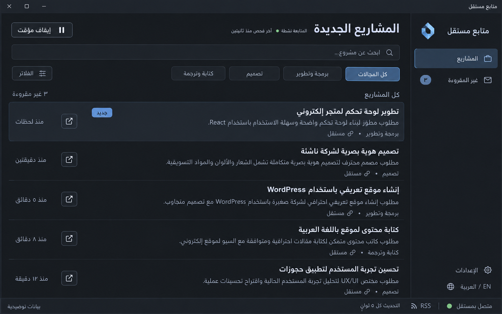
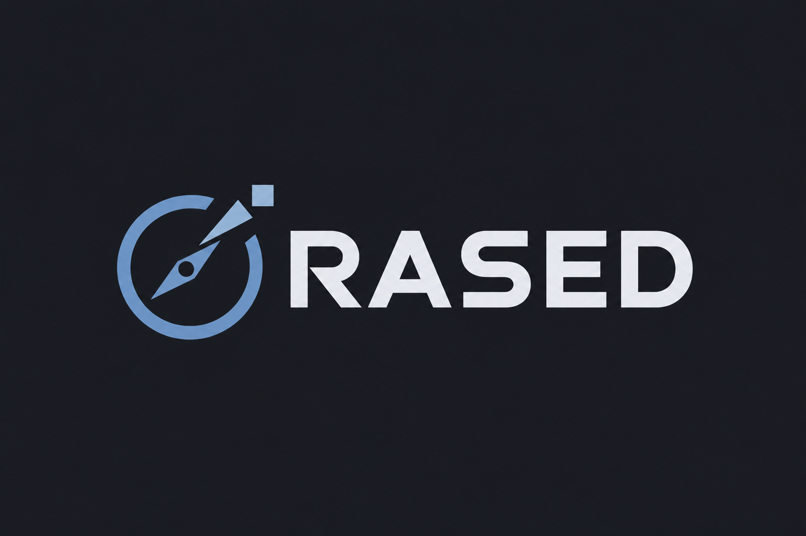

# وثيقة تسليم مشروع راصد — متابعة مشاريع مستقل

> **تحديث محلي 2026-09-26 — 0.2.1:** إعادة تصميم الواجهة وإصلاحات المراجعة موثقة في `docs/UI_UX_FIX_PLAN.md` و`docs/UI_UX_FIX_REPORT.md`. السجل الأصلي أدناه تاريخي؛ الإصدار العام على GitHub لم يتغير عن 0.1.1.

## الحالة الأحدث بعد التنفيذ والمراجعة المستقلة

نفّذ Muse تطبيق RASED 0.1.0 وأرفق `IMPLEMENTATION_REPORT.md` و`IMPLEMENTATION_STATUS.md` والكود والمثبت. الفقرات التاريخية أدناه التي تقول «لم يبدأ التنفيذ» تصف مرحلة التخطيط فقط وليست الحالة الحالية. التفاصيل الفعلية والقرارات التنفيذية راجعها في تقرير التنفيذ مع الأخذ بتصحيحات المراجعة المستقلة.

تمت مراجعة الكود بعد التسليم: typecheck وlint و50 اختبارًا والبناء نجحت، وبصمة المثبت طابقت التقرير. لكن وُجدت 8 مشكلات وظيفية موثقة في `INDEPENDENT_REVIEW.md`، منها مهل قراءة RSS، تطبيق فلاتر العرض، backoff، الإشعارات بعد تغير الإعدادات، انتظار التصنيف، فاصل الفحص، كتم Tray، وإعادة ضبط pagination. ستة اختبارات إثبات محلية تحت `research/review-verification/` تثبت بعض العيوب؛ نجاحها يعني إعادة إنتاج السلوك الخاطئ، وليس قبول الإصدار.

**الحالة الحالية: منفذ ويحتاج إصلاحات قبل الاعتماد اليومي؛ ليست نسخة مقبولة نهائيًا.** لم تعدّل المراجعة كود الإنتاج أو تعِد التثبيت أو تشغّل متابعة حية. الخطوة التالية إصلاح البنود حسب التقرير ثم إعادة التحقق وتغليف مثبت جديد. لا تمحُ الأدلة أو تعتبر نتائج المنفذ اختبارات مستقلة مكررة.

آخر تحديث: 25 سبتمبر 2026 — المنطقة الزمنية للمستخدم: Africa/Cairo.

هذه الوثيقة مستقلة عن المحادثة الأصلية. الغرض منها أن يقرأها مودل أو مطوّر في محادثة جديدة ويفهم هدف المشروع، قرارات المستخدم، ما تم اختباره فعلًا، وما يلزم تنفيذه. لا تفترض أن التطبيق موجود: الموجود حاليًا أبحاث وسكربتات اختبار فقط.

**التسليم التالي:** طلب المستخدم تجهيز خطة مفصلة وبرومبت ليُنفذ Muse Spark 1.3 المشروع بعد مراجعة المجلد، ثم يعود بالناتج لمراجعته هنا. خطة العمل في `IMPLEMENTATION_PLAN.md`، والبرومبت الجاهز في `MUSE_SPARK_IMPLEMENTATION_PROMPT.md`. لم يُستدعَ المودل أو يبدأ التنفيذ تلقائيًا؛ المستخدم سينقل إليه الملفات والطلب. عند التنفيذ يجب قراءة هذه الوثيقة والخطة معًا وتحديث الحالة الفعلية.

## 1. ملخص المشروع والقرار الأخير

تطبيق ديسكتوب محلي لويندوز يراقب المشاريع الجديدة المنشورة للعامة على موقع مستقل، يعرضها بسرعة، ويرسل تنبيهًا يتيح للمستخدم فتح المشروع في متصفحه والتقدم إليه مبكرًا.

هدف المستخدم الأساسي: أن يرى المشروع قبل المنافسين، أو بأقل تأخير ممكن، ليكون من أوائل المتقدمين. الجماليات مهمة، لكن سرعة الاكتشاف والتنبيه والاستقرار هي الأولوية.

**القرار الأحدث المعتمد من المستخدم: نبدأ باستخدام RSS مستقل، ونغيّر طريقة المتابعة لاحقًا إذا أثبتت القياسات أن بديلًا يكتشف المشاريع أسرع. لا نؤجّل بناء التطبيق انتظارًا لحسم المقارنة.**

المصدر المبدئي: https://mostaql.com/rss

الستاك المعتمد: **Electron + React + TypeScript + SQLite**.

التطبيق محلي بالكامل: لا سيرفر خاص بالمشروع، ولا Backend مستضاف، ولا خدمة سحابية مطلوبة. الشخص الذي يريد استخدامه يحمّله ويشغّله على جهازه، وكل نسخة تتصل بمستقل مباشرة. وجود الإنترنت مطلوب لجلب المشاريع، لكن لا حساب داخل تطبيقنا ولا مفتاح API مطلوب وفق المصادر التي اختُبرت.

كان النطاق الأصلي يتضمن مستقل وقسم طلبات الخدمات غير الموجودة في خمسات، ثم قرر المستخدم **تأجيل خمسات والتركيز على مستقل حاليًا**. احتفظ بقابلية إضافة مصدر لاحقًا، ولا تبنِ خمسات أو تجعل استكماله شرطًا لتسليم النسخة الأولى.

## 2. كيف تقرأ هذه الوثيقة

- «معتمد»: طلب أو اختيار صريح من المستخدم؛ لا تفتح النقاش فيه مجددًا دون سبب حقيقي.
- «تم التحقق»: نتيجة لوحظت في الاختبارات المؤرخة هنا، وليست ضمانًا بأن الموقع لن يتغير.
- «مقترح تنفيذي»: اختيار مناسب للبناء، لكنه ليس طلبًا صريحًا من المستخدم ويمكن تعديله بمبرر.
- «غير محسوم»: يحتاج تنفيذًا أو قياسًا أو تجربة فعلية. لا تقدمه كميزة تعمل بالفعل.
- عند التعارض، تعليمات المستخدم الأحدث تتقدم على هذه الوثيقة وتقارير الأبحاث الأقدم.

هذه وثيقة سياق ومواصفات، وليست تصريحًا تلقائيًا لتنفيذ مهام خارج طلب المستخدم القادم؛ مثل نشر إصدار عام أو إنشاء خدمات أو حسابات.

## 3. قرارات المستخدم المعتمدة

| الموضوع | القرار |
|---|---|
| المنصة المستهدفة | تطبيق ويندوز محلي في النسخة الأولى |
| التوزيع | قابل للتحميل والتشغيل على أجهزة أشخاص آخرين، وكل جهاز يتابع مستقل بنفسه |
| المصدر الحالي | مستقل فقط؛ خمسات مؤجل |
| طريقة البداية | RSS، مع إمكانية تبديله إذا ثبت أنه أبطأ في اكتشاف الجديد |
| التقنيات | Electron وReact وTypeScript وSQLite |
| المجالات | جمع كل المجالات، مع فلاتر لمجالات وكلمات معينة |
| اللغات | واجهة عربية وإنجليزية مع RTL وLTR |
| التصميم | يختاره المنفّذ، هادئ ومريح للعين، دون ألوان زاهية أو مظهر قالب AI مبالغ فيه |
| التنبيه | إشعار ويندوز وصوت يمكن تعطيله |
| غلق النافذة | يبقى التطبيق في الخلفية بجانب الساعة؛ خروج كامل من قائمة الأيقونة |
| بدء ويندوز | خيار تشغيل تلقائي مع ويندوز |
| أول استخدام | عرض الموجود كقائمة أولية بلا سيل إشعارات قديمة؛ التنبيه على الجديد بعد بدء المتابعة |
| فتح المشروع | في المتصفح الافتراضي للمستخدم |
| التخزين | محلي، بدون حساب خاص بالتطبيق أو استضافة |

اختار المستخدم اسم «راصد»، ثم طلب أن تكون الكتابة في الشعار بالإنجليزية بدل العربية، وأن يعبّر الرمز عن اكتشاف المشاريع ببوصلة أو كشاف، وترك الاختيار الفني للمنفذ. أحدث تصور هو `rased-logo-v2.png` بكتابة **RASED** ورمز بوصلة موجه نحو هدف. التهجئة اختيار تنفيذي ولم يعتمد المستخدم شكل النسخة الثانية نهائيًا بعد. النسخة العربية `rased-logo-v1.png` محفوظة للتاريخ وليست المرجع الحالي. لم تُحسم مكتبة مكونات، أو إصدار Electron بعينه، أو نوع المثبت النهائي.

**توجيه دائم من المستخدم: وثّق القرارات والتغييرات والمخرجات الجديدة باستمرار في ملف المشروع هذا، ولا تترك سياقًا مهمًا موجودًا في الشات فقط.** حدّث الأقسام القديمة المتعارضة، واحفظ مسارات الأصول وحالة اعتمادها، ولا تعتبر مجرد توليد صورة اعتمادًا نهائيًا من المستخدم.

## 4. تطور الفكرة ولماذا انتهينا لهذا الاختيار

1. بدأ المستخدم بطلب متابعة مستقل وخمسات «في نفس اللحظة ومن غير تأخير».
2. تم توضيح أن صفر تأخير وكون المستخدم أول شخص عالميًا لا يمكن ضمانهما: النشر والمراجعة وتحديث المصدر والشبكة وإشعارات النظام كلها خارج السيطرة الكاملة.
3. اقتُرح أولًا C# و.NET وWPF وSQLite لأن الهدف ويندوز.
4. المستخدم طلب React وElectron لتصميم أحدث، وتم اعتماد TypeScript وNode بدل الإبقاء على C# كجزء إضافي.
5. المستخدم حسم التشغيل المحلي: كل شخص يشغّل نسخته على جهازه، بلا سيرفر مركزي.
6. بعد البحث تم إثبات وجود RSS رسمي لمستقل وصفحات عامة قابلة للقراءة من غير تسجيل دخول.
7. المستخدم أجّل خمسات للتركيز على سرعة مستقل.
8. اقترح فتح متصفح في الخلفية وتحديث صفحة المشاريع كل ثانيتين، مستفيدًا من جلسة المستخدم.
9. تم توضيح أن فتح رابط في المتصفح الافتراضي يختلف عن التحكم فيه وقراءة محتواه؛ التحكم يحتاج إضافة أو وسيلة أتمتة مناسبة. متصفح Electron له جلسة مستقلة ولا يرث تسجيل دخول Chrome أو Edge تلقائيًا.
10. توجد طريقة ثالثة غير RSS والمتصفح: جلب HTML صفحة المشاريع مباشرة بدون عرضها. وقد نجحت في الفحص.
11. تم اختبار RSS ضد HTML متزامنين كل ثانيتين، لكن لم تظهر مشاريع جديدة أثناء نافذة القياس، فحُسم فرق التحميل فقط ولم يُحسم فرق ظهور المشاريع.
12. قرر المستخدم الآن اعتماد RSS مؤقتًا والمضي في التنفيذ، مع قابلية التغيير لاحقًا.

**المتصفح الخلفي ليس جزءًا معتمدًا من التنفيذ الحالي، ولا توجد تجربة فعلية تقيس أداء تحديثه.** لا تدّعِ أنه أبطأ أو أسرع في اكتشاف النشر بناءً على اختبار لم يشمله.

## 5. نطاق النسخة الأولى وما يقع خارجه

داخل النطاق:

- مراقبة RSS مستقل وجمع المشاريع الجديدة من جميع المجالات.
- قائمة سريعة للمشاريع، حالات مقروء/غير مقروء، وروابط فتح المشروع.
- فلاتر مجالات وكلمات؛ توفير بيانات التصنيف يحتاج استكمالًا كما هو موضح لاحقًا.
- إشعارات ويندوز وصوت اختياري وإعدادات تنبيه.
- العمل في الخلفية، أيقونة Tray، وإيقاف/استئناف المتابعة.
- عرض آخر نجاح وحالة الاتصال والأخطاء بدل التوقف الصامت.
- حفظ محلي يمنع تكرار الإعلان بعد إعادة التشغيل.
- عربي وإنجليزي، تصميم متجاوب مع أحجام نافذة الديسكتوب.
- تجهيز نسخة قابلة للتثبيت/التشغيل على جهاز ويندوز آخر.

خارج النطاق الحالي ما لم يطلبه المستخدم لاحقًا:

- خمسات، macOS، Linux، الموبايل، والسيرفرات المركزية.
- التقديم التلقائي على المشاريع أو كتابة وإرسال العروض نيابة عن المستخدم.
- تسجيل دخول داخل تطبيقنا أو تخزين كلمة مرور مستقل أو نسخ جلسة المتصفح.
- تشغيل متصفح خفي أو إضافة متصفح كمتطلب أساسي.
- AI لتوليد العروض، أو تصنيف مدفوع يعتمد على خدمات سحابية.
- ترجمة محتوى المشاريع تلقائيًا؛ المطلوب ترجمة الواجهة.
- ضمان ترتيب المستخدم بين المنافسين أو ضمان وصول التنبيه في زمن مطلق.

## 6. نتائج الفحص المثبتة في 24 سبتمبر 2026

### 6.1 مستقل: المصادر والبيانات

- صفحة المشاريع: https://mostaql.com/projects
- RSS: https://mostaql.com/rss
- صفحة المشاريع نفسها تعلن رابط RSS عبر `link rel="alternate" type="application/rss+xml"`.
- RSS أعاد HTTP 200 وXML يحتوي على 20 عنصرًا في العينة.
- الصفحة أعادت HTTP 200 وHTML يحتوي على 25 مشروعًا في العينة.
- أحدث المشاريع في RSS طابقت القائمة في وقت أخذ العينات؛ هذا ليس إثباتًا للتزامن أثناء النشر.
- RSS يتضمن عنوان المشروع، رابطًا من نوع `https://mostaql.com/go/<id>`، وصفًا مختصرًا، و`pubDate` بتوقيت UTC في العينة.
- صفحة القائمة تتضمن روابط مشاريع وتواريخ نشر، وترتيبًا للأحدث، ورابط صفحة تالية من نوع `https://mostaql.com/projects?page=2`.
- لم تُختبر عملية استرداد متعددة الصفحات بصورة كاملة؛ وجود رابط الصفحة التالية لا يعني أن الاستدراك مكتمل.
- **أرقام المشاريع ليست مرتبة حسب توقيت النشر.** مثال من العينة: مشروع ذو رقم أقل قد يُنشر بعد مشروع ذي رقم أعلى. امنع التكرار بالمجموعة المحفوظة، لا بشرط `id > maxSeenId`.
- RSS لا يعطي كل حقول الميزانية أو التصنيف أو المهارات التي قد تحتاجها الفلاتر.
- قراءة صفحة تفاصيل مشروع واحد نجحت بدون تسجيل دخول؛ استكمال البيانات لجميع الحالات لم يُبنَ أو يُختبر بعد.
- الاستجابات المرصودة لـ RSS وصفحة المشاريع احتوت `Cache-Control: no-cache, private`، ولم يظهر فيها ETag أو Last-Modified.
- `no-cache` لا يثبت عدم وجود تأخير داخل توليد بيانات الموقع، ولا أن المعلومة تظهر فور إرسال صاحب المشروع له.
- مستقل يراجع المشاريع قبل نشرها وفق صفحة المساعدة: https://support.mostaql.com/find-work . نقطة مراقبتنا هي الظهور للعامة، لا وقت إرسال المشروع للمراجعة.

### 6.2 تسجيل الدخول والاتصال اللحظي

- قراءات RSS والقائمة تمت دون كوكيز حساب أو تسجيل دخول أو تشغيل JavaScript في متصفح.
- وجود تسجيل دخول في متصفح المستخدم ليس شرطًا للتنبيه؛ استخدامه الطبيعي للتقديم يتم بعد فتح الرابط.
- وُجد WebSocket/Laravel Echo في ملفات JavaScript العامة لمستقل.
- التهيئة المرصودة مشروطة بتسجيل الدخول، والاشتراك المرصود في قناة خاصة `account.<userId>` لأحداث `notifications.updated` و`notifications.seen`.
- **لم نجد في الملفات المفحوصة قناة عامة تبث جميع المشاريع الجديدة.** هذا وصف للفحص المحدود، وليس إثباتًا أن أي تكامل آخر مستحيل.
- لا تفترض أن الدخول للحساب يجعل اكتشاف كل المشاريع لحظيًا.

### 6.3 القياسات الأولية

أربع عينات لكل مصدر بفاصل 15 ثانية، باستخدام Python urllib وطلبات عامة:

| المصدر | حجم جسم الاستجابة في القراءة الأولية | المدى الزمني للعينات الأربع |
|---|---:|---:|
| RSS مستقل | 18,162 بايت | 0.320–0.450 ثانية |
| HTML مستقل | 169,440 بايت | 0.493–0.588 ثانية |
| HTML خمسات | 157,186 بايت | 0.620–0.742 ثانية |

الأحجام تخص أجسام الاستجابات المرصودة، ولا تمثل بالضرورة حجم النقل المضغوط في Electron. الظروف المحلية والتقنية المستخدمة تؤثر في القياسات.

أول محاولة RSS بـ User-Agent الافتراضي لـ urllib رجعت 503، ومحاولة لاحقة بـ `Mozilla/5.0` نجحت. لا يوجد دليل كافٍ لإسناد السبب إلى User-Agent وحده. لا تفسّر ردًا غير صالح على أنه قائمة فارغة.

### 6.4 مقارنة كل ثانيتين

الأدلة موجودة في `research/comparison-20260924-165246/`.

- طلب RSS وطلب HTML يبدأان بالتزامن تقريبًا كل ثانيتين.
- الهدف الأصلي: حتى نحو 10 دقائق أو 3 مشاريع جديدة تظهر بالمصدرين، مع 20 ثانية متابعة بعدها.
- السكربت الحالي يحد 300 دورة، وليس مهلة جدار زمنية صارمة؛ الطلبات الطويلة قد تجعل المدة تتجاوز 10 دقائق. أصلح ذلك قبل الاعتماد عليه كاختبار طويل مضبوط.
- انتهت التجربة مبكرًا بعد **282.47 ثانية: 4 دقائق و42 ثانية تقريبًا**.
- 137 محاولة لكل مصدر: 136 استجابة ناجحة قابلة للتحليل، وtimeout واحد لكل مصدر في الجولة الأخيرة.
- لم تُرصد IDs جديدة بعد القائمة الأولية: **صفر مشاريع جديدة للمقارنة**.
- RSS: وسيط زمن الجلب والتحليل **0.332 ثانية**، وp95 نحو **0.388 ثانية**.
- HTML: وسيط **0.498 ثانية**، وp95 نحو **0.563 ثانية**.
- فرق الوسيطين نحو **0.166 ثانية لصالح RSS**. هذا فرق وسيطي تحميل، وليس وسيط فرق اكتشاف مشاريع جديدة.
- انتهت الطلبات الأخيرة بمهلة قراءة تقارب 10 ثوانٍ، دون رد HTTP يثبت تقييدًا أو حظرًا.
- توقف السكربت تلقائيًا عند الخطأ؛ لم تُنفذ محاولات تجاوز أو إعادة كثيفة.
- لا نعرف سبب الـ timeout: الشبكة أو الموقع أو غيرهما؛ لا تقدمه كحقيقة أنه حظر IP.
- لم يُختبر تحديث متصفح فعلي، أو جلسة مستخدم مسجّلة، أو Electron في هذه التجربة.

**الاستنتاج الصحيح: RSS أخف وأسرع قراءة في العينة، وسبق اكتشاف المشاريع غير محسوم.** اختيار RSS الحالي قرار عملي من المستخدم، وليس نتيجة تثبت أنه أول مصدر يُحدّث.

## 7. حالة المشروع على القرص

> ملاحظة: هذا الملف لقطة تخطيطية تاريخية قبل التنفيذ. حالة الكود والإصدار الحالي موثقة في `README.md` و`FIX_REPORT.md`.

المسار الحالي: جذر المستودع.

وقت كتابة الوثيقة، لا يوجد تطبيق Electron أو React، ولا `package.json` أو مثبت أو قاعدة بيانات إنتاجية. يوجد تصور بصري مولّد للواجهة قبله المستخدم كمرجع تصميم، لكنه لم يتحول إلى واجهة برمجية. لا تقل إن التطبيق جاهز. الموجود:

| المسار النسبي | الغرض |
|---|---|
| `PROJECT_HANDOFF.md` | هذه الوثيقة؛ مرجع القرارات والسياق |
| `IMPLEMENTATION_PLAN.md` | خطة التنفيذ التفصيلية، المراحل والاختبارات ومعايير التسليم |
| `MUSE_SPARK_IMPLEMENTATION_PROMPT.md` | طلب التنفيذ الجاهز للمودل Muse Spark 1.3 |
| `design-reference-v1.png` | التصور البصري الذي طلب المستخدم حفظه كمرجع للتصميم؛ موجود بجوار هذه الوثيقة |
| `rased-logo-v2.png` | أحدث تصور للشعار: RASED بالإنجليزية مع بوصلة وهدف؛ ينتظر مراجعة المستخدم |
| `rased-logo-v1.png` | تصور الشعار العربي السابق، محفوظ للتاريخ؛ طلب المستخدم استبدال اتجاهه |
| `research/feasibility.md` | تقرير الجدوى الأولي؛ يحتوي على مقترحات أقدم تخص المصدرين |
| `research/probe.py` | فحص صغير للمصدرين وHTML مستقل: أربع دورات بفاصل 15 ثانية |
| `research/initial.json` | بيانات الاستجابات الأولية |
| `research/observations.json` | توقيتات وقوائم IDs من الفحص الأولي |
| `research/compare_mostaql.py` | مقارنة RSS وHTML مستقل كل ثانيتين، تتوقف عند أخطاء |
| `research/comparison-20260924-165246/samples.jsonl` | كل الطلبات المسجلة في المقارنة |
| `research/comparison-20260924-165246/summary.json` | الملخص العددي للمقارنة |
| `research/comparison-20260924-165246/results.md` | تفسير نتائجها وحدودها |
| بقية ملفات `research/` | نسخ HTML وXML وJavaScript وrobots.txt تم فحصها |

ملفات Python أدوات بحث، وليست اختيارًا لإضافة Python كمتطلب لتشغيل التطبيق. لا تضمّن الصفحات والسكريبتات المنسوخة من المواقع في حزمة التوزيع. لا تعتمد على snapshots لإظهار بيانات حية.

إذا نُقل هذا الملف وحده إلى مودل آخر، تفاصيل الأدلة الأساسية موجودة هنا؛ أما مسارات `research/` فلا تكون متاحة إلا إذا نُقل المجلد معها.

## 8. تصميم معماري مقترح

افصل جلب المشاريع عن العرض، وافصل المصدر المنطقي «مستقل» عن وسيلة القراءة «RSS/HTML». تغيير الوسيلة لا يجب أن ينشئ نسخة ثانية من نفس المشروع.

```text
Mostaql RSS
    -> HTTP fetch + validate + parse
    -> normalize IDs / URLs / timestamps
    -> SQLite transaction + deduplication
    -> notify React of new items
    -> notification rules -> Windows notification / sound

Optional enrichment queue -> public project details -> update saved fields
React -> typed preload IPC -> local services -> SQLite / settings / open link
```

تقسيم مقترح:

- **Electron main:** دورة حياة التطبيق، النافذة، Tray، إشعارات النظام، single-instance lock، وفتح الروابط.
- **Collector service:** طلبات الشبكة، جدولة الاستطلاع، backoff، المحوّل الخاص بالمصدر، وقياسات الصحة. يعمل خارج React؛ يمكن أن يبدأ كخدمة asynchronous في main، ويُنقل إلى utility process/worker إذا ثبت أن العمل يضغط على main.
- **Repository:** حفظ المشاريع والإعدادات وحالات التنبيه بترحيلات قاعدة بيانات واضحة.
- **Preload:** واجهة IPC صغيرة ومحددة ومكتوبة الأنواع؛ لا تعرض Node أو SQL عامًّا للواجهة.
- **React renderer:** عرض فقط مع أوامر واضحة للخدمات، وليس مالكًا لدورة المتابعة.
- **Enrichment queue:** استكمال بيانات عدد محدود من المشاريع الجديدة، منفصل عن الطريق السريع للاكتشاف.

اقتراح ملفات قابل للتعديل:

```text
src/
  main/                 # lifecycle, tray, notifications, IPC handlers
  preload/              # typed bridge
  shared/               # models, IPC contracts, settings types
  collector/
    adapters/mostaql-rss.ts
    scheduler.ts
    normalize.ts
    enrichment.ts
  storage/              # database, repositories, migrations
  renderer/
    components/
    pages/
    locales/ar.json
    locales/en.json
    styles/
tests/
resources/
research/               # existing evidence, excluded from release
```

Vite أو electron-vite، وأداة تغليف مثل electron-builder، ومكتبة i18n مناسبة خيارات تنفيذية ممكنة وليست قرارات مستخدم. تحقّق من توثيقها الحالي وتوافقها مع إصدار Electron وSQLite المختار عند البناء، وثبّت الإصدارات بملف lock. تجنب اختيار مكتبات كثيرة بدون حاجة.

## 9. خوارزمية المتابعة المطلوبة

### أول تشغيل ناجح

1. افتح قاعدة البيانات وطبّق migrations.
2. حمّل الإعدادات وحالة المصدر.
3. اجلب RSS مع timeout وحد لحجم الاستجابة والتحقق من المحتوى.
4. استخرج كل العناصر، تحقق من معرفاتها وروابطها، وطبع النصوص والتواريخ.
5. إذا لم تُسجل baseline لهذا المصدر من قبل، احفظ القائمة كبيانات أولية بلا تنبيهات، واحفظ علم اكتمال baseline في نفس المعاملة.
6. أول طلب يفشل لا يحدد baseline، ولا يغيّر قاعدة البيانات إلى قائمة فارغة.
7. اعرض البيانات المحفوظة واستأنف الجدولة.

### الدورات التالية

1. لا تبدأ طلبًا جديدًا لنفس المصدر إذا كان سابقه ما زال يعمل.
2. اقرأ القيم الحالية للإعدادات وحالة backoff.
3. اجلب وتحلل وتحقق من البنية. تحدي حماية أو HTML بدل XML أو body فارغ غير متوقع = فشل واضح، وليس «لا مشاريع».
4. داخل transaction، افحص كل ID مقابل المفتاح الفريد `source + externalId`.
5. حدّث بيانات الموجود دون تنبيه نشر جديد؛ إدخال جديد فقط ينتج حدث اكتشاف. النسخة الأولى لا تحفظ تاريخ تعديلات العنوان والوصف: آخر قيم صالحة تحل محل السابقة، دون تغيير firstSeenAt أو حالة القراءة أو مسح بيانات التفاصيل لمجرد غيابها من RSS.
6. احفظ `firstSeenAt` مرة واحدة و`lastSeenAt` عند كل ظهور، مع `publishedAt` منفصل.
7. بعد نجاح الحفظ، أرسل التحديث إلى React وقيّم قواعد التنبيه.
8. نفّذ enrichment لاحقًا؛ لا تؤخر قائمة المشاريع كلها في انتظاره.
9. حدّث آخر نجاح ومدة الطلب والتوقيت التالي.

### إعادة التشغيل والانقطاع

- لا تعِد baseline تلقائيًا لمجرد إعادة تشغيل التطبيق؛ المشاريع المعروفة تظل معروفة.
- المشروع الذي ظهر أثناء التوقف يُعرض على أنه اكتُشف عند العودة؛ لا توحِ أنك رصدته لحظة نشره.
- مقترح: فصل أحداث الاستدراك عن الجديد المرصود أثناء الاتصال، وتنبيه ملخّص عند وجود عدد كبير من الفائت بدل إغراق المستخدم.
- لا تحذف مشروعًا لأنه خرج من آخر 20 عنصرًا؛ اختفاؤه من RSS لا يثبت إغلاقه أو حذفه.
- لا يمكن ضمان استرجاع جميع المشاريع من RSS وحده بعد غياب طويل؛ النافذة محدودة.
- إن أضفت استدراك HTML متعدد الصفحات، اجعله bounded ومرئي الحالة ومختبرًا، دون إيقاف RSS، وبدون الاعتماد على زيادة IDs. صفحات المشاريع المفتوحة نفسها قد لا تحتوي على مشروع أُغلق أثناء غياب التطبيق؛ لا تدّعِ اكتمال تاريخي مطلق.
- يمكن إطلاق أول نسخة مع توضيح حد RSS والاستدراك المحدود؛ لا تعرض استدراكًا لم يُنفّذ كميزة مضمونة.
- عند sleep تتوقف المتابعة عمليًا؛ عند resume نفذ جلبًا ثم استأنف الجدولة دون تشغيل كل الفحوص التي فاتت دفعة واحدة.

## 10. السرعة والجدولة والأخطاء

**افتراض التنفيذ الأول بعد مراجعة الخطة: 5 ثوانٍ عند أول تشغيل.** هذا اختيار هندسي قابل للتغيير، وليس طلبًا صريحًا من المستخدم أو معدلًا مضمونًا/معلنًا من مستقل. المستخدم اقترح ثانيتين سابقًا، واختبارها القصير لا يثبت استقرارها. أقل فاصل مستقر طويلًا ما زال غير محسوم.

الإعدادات: 5 ثوانٍ افتراضيًا، و15 ثانية، وثانيتان باسم «سريع تجريبي» يختارهما المستخدم يدويًا. backoff وRetry-After يتقدمان على الاختيار. الرقم المعروض في الواجهة يُستمد من الإعداد الفعلي لا من صورة التصميم.

- فاصل ثانيتين = 30 طلبًا/دقيقة لكل مصدر في الظروف السليمة؛ مع مصدرين للمقارنة يصبح 60 طلبًا/دقيقة لكل جهاز، بخلاف التفاصيل.
- نفس معدل الجلب يتكرر على كل نسخة مستخدم؛ التطبيق المحلي لا يجمع الطلبات بين الأجهزة.
- استخدم اتصالًا قابلًا لإعادة الاستخدام حيث يدعم عميل الشبكة ذلك، ووقتًا monotonic لقياس المدد.
- لا تتجاهل سياسات cache ولا تضف cache-busting عشوائيًا لمجرد تسريع ظاهري. يمكن استخدام validators إذا قدمها المصدر لاحقًا؛ لم تُرصد في RSS في العينة.
- عند 429 احترم `Retry-After` إن وُجد، سواء رقم ثوانٍ أو تاريخ HTTP.
- عند timeouts/5xx زد الفاصل تدريجيًا مع حد أعلى وjitter، وارجع تدريجيًا بعد نجاحات. قيم مقترحة وليست ثابتة: 10، 20، 40، 60 ثانية ثم حتى عدة دقائق حسب السبب.
- عند 401/403 أو تحدي حماية أو تغيير دائم في XML، أظهر «المتابعة تحتاج مراجعة» ولا تكرر المحاولات بقوة أو تحاول تجاوز التحدي.
- لو `Retry-After` طويلًا، لا تختصره إلى سقف backoff الأصغر.
- لا تعامل الخطأ كقائمة فارغة أو تحذف المشاريع بسببه.
- لا تسمح بزر «تحديث الآن» بتجاوز backoff المفروض من الخادم أو إنشاء طلب متداخل.
- health states مقترحة: initializing / watching / paused / offline / backing-off / error.
- فصل «آخر محاولة» و«آخر نجاح» و«موعد المحاولة القادمة» مهم حتى لا تظهر بيانات قديمة كأنها حية.

مع فاصل T: انتظار الفحص وحده يقارب 0 إلى T، ومتوسط T/2 يفترض وصول الأحداث بتوزيع مناسب. يضاف إليه تأخر تحديث المصدر والشبكة والتحليل والإشعارات. ليس هناك حد أعلى مضمون أثناء الأعطال.

## 11. نموذج البيانات المقترح

SQLite في مجلد userData الخاص بالتطبيق، لا بجانب ملفات التثبيت. لا تحفظ بيانات مستخدم الاختبار داخل المستودع أو داخل installer.

### projects

- `source`: `mostaql` الآن، وليس `rss`، للسماح بتبديل طريقة الجلب.
- `external_id`: نص للمعرف؛ unique مع source.
- `url`: رابط HTTPS موثوق للمشروع.
- `title`, `description_excerpt`.
- `published_at`: nullable، UTC بعد تحليل ناجح؛ احتفظ بالقيمة الخام للتشخيص إذا احتجت.
- `first_seen_at`, `last_seen_at`: توقيتات اكتشاف محلية محفوظة بصيغة UTC.
- `discovery_kind`: initial / live / recovered؛ تعريفها في الواجهة يجب أن يطابق طريقة الرصد.
- `read_at`: nullable.
- `category_id`, `category_name`, `skills`: nullable أو جدول علاقات حسب الحاجة.
- `budget_min`, `budget_max`, `currency`: nullable؛ لا تخترع ميزانية من نص غير واضح.
- `enrichment_status`: not_requested / pending / ready / failed.
- `created_at`, `updated_at`.

### source_state

baseline_complete، last_success_at، last_attempt_at، next_attempt_at، consecutive_failures، backoff_until، transport_kind، ومؤشرات gap إن كانت مطبقة.

### settings

language، theme إن كان له خيارات، polling_interval، notifications_enabled، sound_enabled، run_at_startup، filter configuration، وهل فلاتر العرض مرتبطة بفلاتر التنبيه. لا تخزن أسرارًا لأن الوظيفة الحالية لا تتطلبها.

### notification_events

معرف مشروع + نوع حدث ومفتاح فريد يمنع إنشاء حدث اكتشاف مكرر. افتراض التنفيذ بعد المراجعة:

- `pending`: حدث مؤهل محفوظ، لم تبدأ محاولة إرساله. يُنشأ ذريًا مع البيانات اللازمة له بعد استيفاء قواعد التنبيه، وليس قبل حسم الفلتر.
- `dispatching`: تُعتمد هذه الحالة قبل استدعاء إشعار النظام مع معرف جلسة التشغيل ووقت المحاولة.
- `submitted`: طُلب الإرسال دون خطأ فوري؛ لا يعني أن المستخدم رأى الإشعار. يُسجل حدث العرض/الفشل إن توفر منفصلًا وفق API.
- `failed`: فشل معلوم، لا إعادة إرسال لا نهائية؛ المشروع يظل ظاهرًا.
- `uncertain`: تتحول إليها أحداث dispatching من جلسة سابقة بعد التعطل، ولا يعاد إرسالها تلقائيًا، بغض النظر عن عمرها. لا حد اعتباطي «أقدم من دقيقة».
- أحداث pending التي لم تبدأ يمكن استئنافها وفق قواعد التنبيه الحالية وسياسة الاستدراك؛ لا تصنّف كل pending كغير مؤكد الإرسال.
- افتراض الاستدراك: ملخص واحد للأحداث القديمة المؤهلة عند العودة، بدل سيل إشعارات منفصلة، مع سجل دفعة يمنع تكرار الملخص في التشغيل الطبيعي. submitted وuncertain لا يعاد إرسالهما تلقائيًا.

السياسة تفضّل منع التكرار على إعادة الإرسال عند عدم اليقين. قد يفوت إشعار لو انهار التطبيق بعد اعتماد dispatching وقبل الإرسال، لكن المشروع يبقى غير مقروء في القائمة. SQLite وإشعار Windows ليسا معاملة ذرية واحدة؛ لا ضمان exactly-once أو رؤية المستخدم للإشعار. هذه مواصفات تنفيذية وليست ميزات منفذة.

### diagnostics

سجل محدود أو rotated: توقيت الطلب، endpoint kind، status، duration، item count، error category. لا تحتفظ بكل استجابة HTML للأبد. فترة الاحتفاظ وحجمها قرار تنفيذي يحتاج سقفًا، لا حذفًا صامتًا لسجل IDs يؤدي لإعادة التنبيه على القديم.

## 12. الفلاتر واستكمال التفاصيل

المستخدم يريد جميع المجالات مع فلترة؛ لا تضيق المصدر من البداية على تخصص واحد.

- فصل فلاتر العرض عن فلاتر التنبيه، مع خيار بسيط لتطبيق نفس الفلاتر عليهما.
- فلاتر كلمات في العنوان والوصف المتاح، مع سلوك موضح لـ«أي كلمة» و«كل الكلمات» والاستثناءات لو أضيفت.
- احتفظ بالنص الأصلي للعرض؛ استخدم تطبيعًا خفيفًا للبحث العربي والإنجليزي دون إفساد المصطلحات التقنية.
- تصنيف المجال ليس مؤكدًا من RSS؛ استخدم تصنيفًا فعليًا من تفاصيل موثقة إن توفر.
- لا تسمِّ تخمينًا مبنيًا على الكلمات «تصنيف مستقل الرسمي».
- المشروع الناقص التصنيف يظهر في «الكل» بحالة تفاصيل لم تكتمل، ولا يسقط من التخزين.
- عند «كل المجالات» وعدم وجود شرط يحتاج بيانات ناقصة: نبّه بعد اكتشاف المشروع وحفظه دون انتظار التفاصيل.
- عند فلتر مجال/شرط يتطلب بيانات ناقصة: انتظر تفاصيل هذا المشروع فقط بميزانية أولية 30 ثانية من الاكتشاف تشمل الطابور. لا توقف بقية المحرك. عند اكتمال البيانات، أعد تقييم قواعد المستخدم الحالية؛ المطابق ينبه مرة وغير المطابق لا ينبه.
- إذا فشل استكمال التفاصيل أو انتهت المهلة، يبقى المشروع في «الكل» موسومًا «تصنيف غير مؤكد»، مع عدد واضح للمشاريع التي لم تُحسم مطابقتها. الافتراضي لا يتجاوز الفلتر بإشعار عام.
- خيار «نبّهني أيضًا بالمشاريع غير مؤكدة التصنيف» معطل افتراضيًا؛ تفعيله يسمح بإشعار موسوم عند نهاية المهلة. اكتمال التفاصيل لاحقًا لا يكرره.
- وصول التصنيف بعد انتهاء المهلة يحدّث القائمة ولا ينتج إشعار نشر متأخرًا تلقائيًا في النسخة الأولى. يظل المشروع غير المقروء قابلًا للمراجعة. مهلة 30 ثانية سياسة محلية وليست ضمان استجابة من الموقع.
- مقترح افتراضي لأول تشغيل: كل المشاريع وكل التنبيهات، ثم يخصصها المستخدم.
- فلتر الميزانية ميزة اختيارية إذا توفرت البيانات؛ لا تجعلها سببًا لتأخير المحرك الأساسي.
- جلب التفاصيل مرة للمشروع الجديد مع cache محلي وconcurrency محدود، لا فتح كل المشاريع في كل دورة.

## 13. الواجهة والتصميم

تفضيل المستخدم المباشر: حديث وهادئ، مريح للعين، دون ألوان زاهية أو مظهر «AI» واضح. عُرض على المستخدم تصور بصري، وقبله وطلب حفظه مع هذه الوثيقة كمرجع. لا يوجد ملف Figma؛ المرجع صورة مولّدة وليست واجهة منفذة.

### المرجع البصري المحفوظ



ملف الصورة: `design-reference-v1.png` بجوار هذا الملف. انقل الملفين معًا عند تسليم المشروع لمودل أو مطوّر آخر، واطلب منه فتح الصورة فعليًا قبل تنفيذ الواجهة.

- اتبع الاتجاه العام للصورة: خلفية رمادية فحمية، أزرق هادئ للتحديد، قائمة مشاريع واضحة، شريط تنقل على اليمين في العربية، بحث وفلاتر بالأعلى، وحالة المتابعة ظاهرة.
- الصورة مرجع للألوان وتوزيع العناصر والكثافة البصرية، وليست مصدرًا للقيم التشغيلية أو قائمة متطلبات جديدة.
- عناوين المشاريع والأعداد وتوقيتات الفحص في الصورة بيانات توضيحية. ظهور «التحديث كل ٥ ثوانٍ» لا يحسم فاصل الإنتاج؛ راجع قسم الجدولة.
- الاسم الظاهر «متابع مستقل» في صورة الواجهة قديم؛ الاسم المعتمد الآن «راصد»، ويجب استخدامه عند التنفيذ.
- صحّح أي أخطاء نصية أو تفاصيل محاذاة في الصورة عند التنفيذ، وحافظ على التباين وإمكانية الوصول.
- الصورة وُلدت باستخدام أداة image_gen المدمجة. ملخص وصف التوليد: واجهة Windows عربية RTL لمتابعة مشاريع مستقل، بخلفية فحمية وأزرق منخفض التشبع، وقائمة من خمسة مشاريع، وأشرطة بحث وفلاتر وتنقل وحالة اتصال، دون زخارف أو ألوان نيون.

اتجاه تصميم مقترح:

- خلفيات رمادية محايدة داكنة، أسطح متميزة بدرجة صغيرة، وأزرق هادئ للإجراء الأساسي والتحديد.
- تجنب النيون، التدرجات البنفسجية المنتشرة، الزجاجية المبالغ فيها، الوهج، الزخارف غير الوظيفية، والإيموجي على كل عنوان.
- قائمة واضحة وكثافة معتدلة بدل شبكة كروت ضخمة. العنوان أهم عنصر، ثم الوصف القصير والتوقيت والحالة.
- تباين نصوص واضح، حدود وألوان حالات قابلة للتمييز، وأحجام خطوط مريحة؛ الهدوء ليس تقليل التباين إلى درجة ضعف القراءة.
- لا تعرض كلمة «فوري» أو «مباشر الآن» إذا الاتصال متعطل أو البيانات قديمة.
- لا يلزم الوضع الفاتح في أول نسخة؛ theme switch إضافة اختيارية، بينما دعم اللغتين معتمد.

تكوين شاشة مقترح:

1. شريط علوي باسم مؤقت للتطبيق، حالة المتابعة، آخر نجاح، زر إيقاف/استئناف، وإعدادات.
2. منطقة بحث وفلاتر قابلة للإخفاء لتوفير المساحة.
3. قائمة المشاريع: علامة جديد/غير مقروء، عنوان، وصف مختصر، تاريخ النشر ووقت اكتشاف البرنامج عند الحاجة، وتصنيف/ميزانية إن توفرا.
4. زر واضح لفتح المشروع. يمكن فتحه بالنقر على العنوان أيضًا.
5. تفاصيل محلية اختيارية سريعة؛ لا تحتاج iframe للموقع نفسه.
6. صفحة إعدادات: اللغة، فترة الفحص، الصوت والتنبيهات، بدء ويندوز، خيارات الفلاتر.

حالات واجهة يجب تصميمها: أول تحميل، لا نتائج للفلتر، انقطاع اتصال مع استمرار عرض المحفوظ، backoff، فشل تحليل المصدر، تفاصيل ناقصة، المتابعة متوقفة يدويًا، وbaseline مكتملة.

### مرجع شعار راصد



ملف `rased-logo-v2.png` محفوظ بجوار هذه الوثيقة، وهو أحدث مقترح بصري وليس اعتمادًا نهائيًا. يضم كلمة **RASED** بالإنجليزية على اليمين ورمز بوصلة على اليسار. الإبرة تتجه إلى مربع صغير خارج الإطار الدائري المفتوح، كأنها تحدد فرصة جديدة؛ الجزء المثلث العلوي يوحي باتجاه البحث. الرمز أزرق هادئ والكتابة فاتحة والخلفية فحمية. طلب المستخدم كتابة إنجليزية للشعار لا يلغي واجهة التطبيق الثنائية اللغة.

هذا تصور PNG مولّد باستخدام image_gen المدمجة، وليس SVG أو أيقونة ICO نهائية، وخلفيته ليست شفافة. يمكن تطوير رمز منفصل وأحجام صغيرة بعد اعتماد الشكل. لا تصف الصورة بأنها أصل vector جاهز للإنتاج.

ملخص وصف التوليد: شعار أفقي إنجليزي RASED، بوصلة هندسية بسيطة بإبرة/اتجاه بحث نحو هدف مربع، أزرق #799ABC ومساعد #A5BDD5 وكتابة #E8EBF0 وخلفية #181B20، مسطّح وواضح دون زخرفة. ظهرت في المحاولة الأولى إضاءة وهالة قوية غير مناسبة؛ تم تعديل الصورة بالأداة لإزالة الوهج والحفاظ على الكتابة والتكوين ورمز البوصلة. النسخة المحفوظة v2 هي النتيجة المصححة. قيم الألوان أهداف تصميمية وليست ضمانًا لتطابق كل بكسل مولّد معها.

النسخة السابقة `rased-logo-v1.png` تضم كتابة عربية ورمز رادار؛ تبقى محفوظة ولا تُستخدم تلقائيًا في الواجهة بعد طلب التحويل إلى الإنجليزية. الاسم المؤقت والشعار في صورة `design-reference-v1.png` قديمان؛ استبدلهما بالهوية الأحدث عند التنفيذ دون تغيير اتجاه الواجهة العام.

### تجهيز جهاز التطوير — سياق المستخدم

المستخدم ذكر أنه لم يستخدم Electron أو SQLite من قبل، وسأل عن البرامج واللغات المطلوبة. تم توضيح الآتي، دون تنفيذ تثبيت فعلي في هذه المحادثة:

- جهاز التطوير يحتاج Node.js ومعه npm؛ افحص الموجود والتوافق قبل التثبيت.
- Electron وReact وTypeScript تُثبت كاعتماديات للمشروع، لا كتطبيقات مستقلة للمستخدم النهائي.
- SQLite قاعدة محلية داخل ملف، ولا تحتاج سيرفر قواعد بيانات أو تثبيت «لغة SQL». الكود يتعامل معها بمكتبة مناسبة.
- بعض مكتبات SQLite الأصلية قد تحتاج أدوات بناء أو إعادة بناء للتوافق مع Electron؛ يعتمد ذلك على المكتبة والإصدارات، وليس متطلبًا محسومًا الآن.
- المستخدم النهائي يتلقى تطبيقًا مجمعًا ولا يلزمه تثبيت Node.js أو Electron أو SQLite منفصلة.
- لا تفترض أن الأدوات تم تثبيتها أو التحقق منها بسبب هذا الشرح؛ تحقق عند بدء التنفيذ.

### متطلبات اللغات

- كل نصوص الواجهة في ملفات ترجمة، بما فيها الأخطاء وTray والإشعارات قدر الإمكان.
- تبديل `dir` مع اللغة، واستخدام CSS logical properties بدل افتراض left/right في كل المواضع.
- عناوين المشاريع تظل بلغتها الأصلية؛ استخدم اتجاهًا مناسبًا للنصوص المختلطة والروابط والأرقام.
- خزّن التوقيت UTC واعرضه حسب إعداد الجهاز/اللغة؛ لا تثبّت Cairo لكل مستخدمي التطبيق لأنه موقع المستخدم الحالي فقط.
- دعم لوحة المفاتيح وfocus واضح، وأسماء للأزرار ذات الأيقونات.
- اختر خطًا عربيًا وإنجليزيًا مناسبين وتحقق من ترخيص التوزيع، ويفضّل تضمين الموارد اللازمة للعمل المحلي بدل الاعتماد على CDN للواجهة.

## 14. سلوك ويندوز والتوزيع

- قفل single instance يمنع تشغيل نسختين ومضاعفة الطلبات والتنبيهات.
- القفل لنفس جهاز/سياق مستخدم فقط. الأجهزة المختلفة مستقلة في البيانات والقراءة والإعدادات والتنبيهات بلا مزامنة. طلباتها تتجمع، وقد تشترك في IP خارجي واحد على الشبكة نفسها.
- غلق النافذة يخفيها إلى Tray ما لم يكن خروجًا صريحًا؛ إظهار رسالة قصيرة أول مرة يوضح استمرار المتابعة.
- قائمة Tray: فتح التطبيق، إيقاف/استئناف، كتم الصوت أو رابط الإعدادات، خروج.
- الخروج الصريح يلغي الطلبات والمؤقتات وينهي عمليات التطبيق ويغلق قاعدة البيانات بأمان.
- التشغيل مع ويندوز اختياري ويمكن تعطيله؛ لا يفرض نفسه بدون اختيار المستخدم.
- التنبيه ينقل المستخدم إلى المشروع في متصفحه؛ تحقق من ذلك على نسخة packaged، لا dev فقط.
- وضع عدم الإزعاج وإعدادات إشعارات Windows قد تؤخر أو تمنع العرض؛ عرض الاكتشاف داخل التطبيق مستقل عن ذلك.
- التثبيت local/per-user خيار مناسب؛ حسم NSIS أو portable أو كليهما بعد اختبار بناء صالح.
- التوزيع لا يتطلب Backend، لكن تنزيل الإصدارات لاحقًا يحتاج قناة توزيع. التحديث التلقائي ليس معتمدًا ولا إلزاميًا في النسخة الأولى؛ يمكن التحديث يدويًا.
- توقيع البرنامج وشهادة التوقيع ليسا مُجهزين. إصدار غير موقع قد يظهر معه تنبيه نظام؛ لا تدّعِ أنه موقع.
- تجنب فقد SQLite والإعدادات عند ترقية الإصدار؛ migrations يجب أن تعمل على نسخة سابقة محفوظة.
- لا تضف telemetry أو analytics خارجيًا افتراضيًا.

## 15. حدود الأمان اللازمة للتنفيذ

- React لا يحصل على `nodeIntegration`؛ استخدم `contextIsolation` وpreload محدودًا وإعدادات Electron الآمنة المناسبة.
- لا تعرض وصف الموقع كـHTML خام قابل للتنفيذ. نص عادي أو sanitization موثوق عند الحاجة.
- لا تحمل صفحات مستقل داخل renderer بصلاحيات Node.
- تحقق من أنواع ومدخلات IPC؛ لا endpoint يسمح بتنفيذ shell أو استعلام SQL اعتباطي.
- افتح فقط روابط HTTPS متوقعة لمستقل، وتحقق من hostname الحقيقي لا مجرد وجود كلمة mostaql في النص. امنع `javascript:` و`file:` والبروتوكولات غير المطلوبة.
- تعامل مع XML كبيانات غير موثوقة: لا external entities أو DTD resolution أو تحميل موارد خارجية، وحدود للحجم والوقت.
- SQL بمعاملات parameterized، ومسارات تخزين تحت userData.
- لا نسخ لكوكيز المتصفح ولا كلمات مرور؛ ليس ذلك مطلوبًا للمهمة.
- لا تحاول تجاوز تقييد أو CAPTCHA. سجّل الحالة واهدأ أو أوقف المصدر حسب نوع الخطأ.

## 16. خطة تنفيذ مقترحة

الخطة التفصيلية الأحدث في `IMPLEMENTATION_PLAN.md` تحوّل المراحل التالية إلى مهام ومعايير مرور ومخرجات. تتضمن افتراضات بدء وافق المستخدم على الاتجاه العام لها: العربية أولًا، الشعار v2 مرجع مؤقت، مثبت Windows لكل مستخدم، التنبيهات لكل المجالات افتراضيًا، والتشغيل مع ويندوز معطل حتى تفعيله. الصوت المفعّل أولًا واختيار عمارة البناء وحدود أحجام الاستجابة تفاصيل تنفيذية قابلة للتعديل وليست نتائج تجربة.

يجب أن يسلم المنفذ `IMPLEMENTATION_STATUS.md` و`IMPLEMENTATION_REPORT.md` وREADME وصورًا فعلية للواجهة ومثبتًا مختبرًا. هذه الملفات المستقبلية ليست موجودة لمجرد ذكرها هنا؛ لا تنشئ تقرير نجاح وهميًا قبل التنفيذ. بعد العودة بالمشروع، تبدأ المراجعة المستقلة من تقرير التنفيذ وربط المتطلبات باختباراتها، ثم فحص الكود وتشغيل التحقق المناسب.

### المرحلة A: أساس قابل للتشغيل

- فحص ملفات المشروع الحالية وقراءة أي AGENTS.md يظهر لاحقًا.
- إنشاء Electron/React/TypeScript مع dev command واضح وبناء إنتاجي قابل للتكرار.
- إعداد preload وIPC وSQLite وmigrations والأنواع المشتركة.
- تشغيل نافذة أولية باللغة المختارة، بدون ادعاء ميزات غير مبنية.
- قبل بناء المحرك، شغّل نسخة Windows مجمّعة تجريبية تستخدم SQLite فعليًا: إنشاء قاعدة تحت userData، إدخال/قراءة سجل، وإعادة تشغيل والتحقق من بقائه. نجاح build وحده لا يكفي. تحقق من التوافق مع إصدار ومعمارية Electron وrebuild إن احتاجت المكتبة الأصلية ذلك؛ لا تفترض أن better-sqlite3 اختيرت أو أن node:sqlite بديل مدعوم دون تحقق. اختبار جهاز نظيف بلا Node شرط قبل الإصدار إذا تعذر إجراؤه في هذه المرحلة.

### المرحلة B: محرك RSS

- adapter قابل للاستبدال، تحليل XML وتطبيع ID والرابط والتواريخ.
- scheduler ومنع overlap والـtimeout والـbackoff.
- baseline ومنع التكرار ومعالجة إعادة التشغيل.
- بيانات مشاريع حقيقية في القائمة مع آخر نجاح وحالات الأعطال.
- إشعار اكتشاف مبكر دون انتظار enrichment.

### المرحلة C: استخدام يومي

- تصميم القائمة والفلاتر والإعدادات بالعربية والإنجليزية.
- إشعارات النظام والصوت الاختياري وفتح المتصفح.
- Tray وsingle-instance والتشغيل الاختياري مع ويندوز.
- enrichment للمجالات المطلوبة مع حالة البيانات الناقصة.

### المرحلة D: استقرار وتغليف

- اختبار offline/resume وtimeout و429 وXML غير صالح وقاعدة موجودة.
- تحقق بصري من RTL/LTR والنافذة الصغيرة والتباين والـfocus.
- بناء installer/portable مختبر على Windows وشرح تشغيل موجز.
- اختبار النسخة المجمعة، خصوصًا SQLite native module إن استُخدم، ومسار userData والتنبيهات وTray.

### المرحلة E: تحسين مبني على قياس

- استدراك HTML متعدد الصفحات مؤجل من الإصدار الأول؛ الاستدراك الأولي محدود بما بقي في RSS مع إظهار احتمال الفجوة بعد الغياب. راجع الحاجة بعد استخدام واقعي دون فرض انتظار أسبوع محدد.
- أطول تشغيل واقعي مع RSS وتسجيل محدود، ثم مقارنة HTML اختيارية عند وجود سبب.
- لا حاجة إلى بناء واجهة مراقبة مقارنة معقدة داخل النسخة الأولى.
- بدّل المصدر إذا ظهر دليل على فرق اكتشاف متكرر مؤثر، مع الاحتفاظ بنفس IDs والتخزين والواجهة.

## 17. التحقق ومعايير القبول

اختبارات مهمة بدل اختبارات شكلية:

- fixture RSS صالح متعدد العناصر -> IDs وتواريخ صحيحة.
- ID أصغر يصل بعد ID أكبر -> يُكتشف كمشروع جديد.
- نفس RSS يتكرر أو يُعاد ترتيبه -> لا تنبيه إضافي.
- first run -> حفظ وعرض دون تنبيهات قديمة.
- إعادة تشغيل مع DB موجودة -> لا تكرار، والجديد الحقيقي يُكتشف.
- XML غير صالح/HTML challenge/رد فارغ غير متوقع -> حالة خطأ دون فقد البيانات أو baseline.
- طلب أبطأ من interval -> لا تداخل أو تراكم طلبات.
- 429 مع Retry-After -> جدولة ملتزمة؛ timeout -> backoff وتعافٍ.
- تغيير وسيلة RSS إلى HTML مستقبلًا -> لا نسخ مكررة للمشاريع نفسها.
- بيانات التصنيف غير موجودة -> لا تصنيف مختلق ولا استبعاد خفي من «الكل».
- فشل التفاصيل -> يظل المشروع المكتشف ظاهرًا وقابلًا للفتح.
- نافذة مغلقة إلى Tray -> تستمر المتابعة؛ خروج صريح -> تنتهي.
- تحديث الواجهة أو تبديل اللغة -> لا ينشئ collector إضافيًا.
- روابط غير موثوقة ونصوص تحتوي HTML -> لا تنفيذ محتوى أو فتح بروتوكول خطر.
- التثبيت وإعادة التشغيل وحفظ الإعدادات والتنبيه بالنسخة المجمعة تعمل فعليًا.
- اختبر crash قبل dispatching وبعده وبعد استدعاء الإشعار: pending يستأنف وفق الاستدراك، وdispatching من جلسة سابقة يصبح uncertain بلا إعادة تلقائية، والبيانات المحفوظة لا تضيع.
- فلتر مجال وتفاصيل ناقصة: لا إشعار عام افتراضيًا، والحالة واضحة. الخيار الأوسع ينتج إشعارًا موسومًا واحدًا، والتصنيف المتأخر لا يكرره. تغيير الفلتر أثناء الانتظار يُحترم.
- SQLite تعمل في نسخة packaged مبكرة وتحفظ السجل بعد إعادة التشغيل.
- اختبر رمز التطبيق منفردًا عند 16 و32 بكسل وعلى خلفيات Tray مختلفة قبل الإصدار؛ إن ضاعت التفاصيل، استخدم نسخة مبسطة للأحجام الصغيرة بدل تصغير الشعار الكامل.
- جهازان لهما حالة مستقلة دون إيحاء بمزامنة؛ نفس الجهاز يخضع لقفل النسخة الواحدة.

قياس الزمن الداخلي من انتهاء تحليل الاستجابة إلى عرض/جدولة التنبيه مفيد، لكن أي رقم مستهدف له يُحدد ويُختبر، ولا ينسب لتأخير النشر الكلي. لا تجعل «أول واحد في العالم» معيار قبول لأنه غير قابل للقياس من هذا التطبيق.

## 18. طريقة مقارنة المصادر لاحقًا

إذا طُلبت مقارنة جديدة:

1. اجلب RSS وHTML في ظروف متقاربة وابدأ الطلبين بالتزامن، مع تسجيل وقت بدء وانتهاء مستقلين لكل طلب.
2. استبعد اتحاد IDs الموجودة في أول قراءة ناجحة للمصدرين من حساب المشاريع الجديدة.
3. لكل ID جديد، سجّل أول ظهور بكل مصدر وآخر طلب ناجح لم يكن يحتويه، ومجال عدم اليقين الناتج عن فترة الفحص.
4. استخدم monotonic للمدد وترتيب القياس؛ UTC لربط الأحداث بالسجلات.
5. سجّل أخطاء كل مصدر والفجوات؛ لا تعتبر مصدرًا خاسرًا أثناء انقطاع غير قابل للمقارنة.
6. لا تستخدم `pubDate` كأنه وقت الإتاحة الدقيق أو تقيس الفرق بينه وبين أول اكتشاف وتسمّيه تأخير RSS المؤكد.
7. لا تعتبر مشروعًا لم يظهر في الطرف الآخر «مفقودًا للأبد» عند نهاية نافذة قصيرة؛ صنفه pending/unmatched.
8. اجمع عدة مشاريع فعلية في أكثر من نافذة، وحدد مدة واستهلاكًا محدودين وتراجعًا عند الأخطاء.
9. افصل فرق تحميل البيانات عن فرق ظهورها. النتائج دون مشاريع جديدة غير حاسمة للاكتشاف.
10. إذا كانت المقارنة تشمل متصفحًا فعليًا، قِس وصول بيانات القائمة لا انتهاء تحميل الصور والإعلانات، ووثّق نوع المتصفح وحالة تسجيل الدخول والكاش. لا تفترض نتائج متصفح لم تختبره.

تشغيل سكربت المقارنة الموجود يعيد اختبارًا حقيقيًا يرسل طلبات للموقع؛ ليس اختبار unit محليًا. لا تشغّله تلقائيًا مع كل build أو كل test suite.

## 19. خمسات — سياق مؤجل فقط

الرابط: https://khamsat.com/community/requests

- الصفحة العامة نجحت دون تسجيل دخول، وتضمنت 25 طلبًا في العينة.
- ترتيبها المرصود حسب آخر تفاعل؛ توجد تواريخ نشر أصلية منفصلة.
- قارن IDs كاملة، ولا تعتبر ارتفاع طلب بسبب تعليق طلبًا جديدًا.
- لا RSS معلن في الصفحة التي فُحصت.
- زر الأقدم يستخدم في الكود العام POST إلى `/ajax/load_more/community/requests` مع IDs المعروضة؛ لم يُستدعَ في الاختبار، وrobots.txt يمنع `/ajax/*`.
- قراءة صفحة تفاصيل واحدة أعادت HTTP 202 بجسم فارغ، فلا توجد نتيجة تثبت أن استكمال الأوصاف يعمل.
- استرداد ما بعد أول 25 طلبًا غير محسوم.
- هذه المعلومات تُحفظ للمستقبل فقط؛ لا تضف خمسات الآن ولا تعرض تبويبًا معطلًا كبيرًا يشوش النسخة الأولى.

## 20. أمور لا تزال غير محسومة

- زمن الإتاحة الحقيقي في RSS مقارنة بصفحة المشاريع أثناء نشر جديد.
- أقل فاصل فحص مستقر لساعات وأيام؛ لا حد رسمي مثبت في البحث الحالي.
- سلوك الشبكة بعد توزيع البرنامج على أجهزة مختلفة، والاستقرار عند معدلات طلب مرتفعة.
- أفضل مصدر موثوق للتصنيفات والميزانيات، وتكلفة enrichment.
- مدى الاستدراك الممكن بعد انقطاع طويل، خصوصًا المشاريع التي أغلقت أثناء الغياب.
- اعتماد الشعار النهائي، أرقام إصدارات المكتبات، أداة بناء المثبت، وشهادة التوقيع. اسم «راصد» معتمد بالفعل.
- التحقق التطبيقي من سياسة ملخص الاستدراك ومنع تكراره، والاحتفاظ بالسجل، وعرض الأوصاف المطولة؛ الافتراضات التنفيذية هنا قابلة للتعديل.

لا تحول هذه النقاط إلى سلسلة أسئلة توقف العمل. نفذ القرارات المحسومة، واختر افتراضات تنفيذية معقولة قابلة للتغيير، واطلب توضيحًا فقط عندما يغيّر قرار المستخدم النطاق أو يلزم لإنجاز خطوة بعينها.

## 21. تعليمات الاستئناف للمودل القادم

### مراجعة Claude المستلمة وتقييمها

وصلت مراجعة Claude عبر المستخدم. أصلها محفوظ في `research/claude-review-original.txt` وتقييمها بندًا بندًا في `research/claude-review-response.md`. راجع Claude الوثيقة والصورتين، ولم يراجع سكربتات البحث أو البيانات الخام؛ تعليقاته على التجربة مبنية على الوصف. البرومبت محفوظ في `CLAUDE_REVIEW_PROMPT.md`.

حُدثت الخطة بافتراض 5 ثوانٍ، واختبار SQLite المجمعة مبكرًا، وسياسات التفاصيل الناقصة والإشعارات بعد التعطل، والتحديث الصامت واستقلال الأجهزة، وتأجيل استدراك HTML. التنبيه العام صار اختياريًا بدل تجاوزه للفلتر افتراضيًا، وحالات الإرسال حلّت محل حد دقيقة الاعتباطي. لم يُنفذ التطبيق أو تُعدّل سكربتات البحث أو تُجرَ تجربة حية جديدة في هذه الخطوة.

تصحيح مهم: تجربة 282.47 ثانية توقفت بسبب timeout كما يثبت summary.json والكود، وليس حد 300 دورة. المهلة الزمنية الفعلية تحسين مستقل مطلوب قبل مقارنة مستقبلية رسمية. مجرد تغليف thread blocking بـasyncio.wait_for لا يكفي لافتراض إلغاء طلب الشبكة؛ تحقق من الإلغاء والمهل عند إصلاح الأداة.

1. اقرأ هذه الوثيقة أولًا، ثم افحص الملفات الفعلية؛ قد يكون المشروع تطور بعد تاريخها.
2. لا تبدأ النقاش من C# أو WPF أو السيرفر المركزي؛ هذه اختيارات تجاوزناها.
3. لا تطلب تأكيد اعتماد RSS؛ هذا هو القرار الأخير الصريح.
4. لا تعطّل البناء بسبب أن تجربة السبق غير حاسمة؛ المستخدم وافق على RSS مع قابلية التغيير.
5. لا تعد بنتائج لم تُقَس أو ميزات لم تُنفّذ، وميّز بين بيانات الموقع ووقت اكتشاف التطبيق لها.
6. حافظ على أولوية السرعة والوضوح والواجهة الهادئة ودعم اللغتين.
7. ركّز على مستقل فقط، واجعل RSS adapter قابلًا للاستبدال دون تعقيد زائد.
8. عند طلب التنفيذ، نفّذ واختبر وسلّم نتيجة قابلة للتشغيل، مع توضيح الأجزاء المتبقية بصدق.
9. لا تنشر إصدارًا عامًا أو تنشئ استضافة أو ترسل رسائل لأطراف أخرى دون طلب مناسب.
10. حدّث هذه الوثيقة عند تغيّر قرار جوهري، مع الحفاظ على فصل «المثبت» و«المقترح».

نص مختصر يمكن للمستخدم إرساله مع الملف في محادثة جديدة:

> اقرأ PROJECT_HANDOFF.md كاملًا وافحص حالة المشروع الحالية. هذا هو سياق المشروع وقراراته المعتمدة. نبدأ بتطبيق ويندوز محلي باستخدام Electron وReact وTypeScript وSQLite، لمتابعة RSS مستقل بسرعة، وخمسات مؤجل. لا نستخدم سيرفرًا مركزيًا. الواجهة عربية وإنجليزية بألوان هادئة. اعتمد RSS حاليًا مع قابلية تغييره لاحقًا، ثم نفذ المهمة التي أطلبها بناءً على هذا السياق، دون اعتبار المقترحات أو الاختبارات القديمة ميزات جاهزة.

## 22. حالة التنفيذ الفعلية (25 سبتمبر 2026 — تُقرأ بعد كل ما سبق)

نُفّذ التطبيق فعليًا (RASED 0.1.0) داخل هذا المجلد: Electron 44.4.5 وReact
19 وTypeScript 5.9 وSQLite عبر `node:sqlite` المدمجة (لا better-sqlite3، لا
rebuild أصلي). التفاصيل الكاملة في `IMPLEMENTATION_REPORT.md`، والحالة
الحية في `IMPLEMENTATION_STATUS.md`.

المثبت: `release/RASED Setup 0.1.0.exe` (x64، per-user، **غير موقع**،
SHA256 في التقرير). جُرّب: تثبيت صامت، تشغيل مستقل (baseline حقيقي)، إزالة
نظيفة. أول baseline بلا تنبيهات؛ الرصد الحي الوحيد الموثق: مشروع 1280350
(pubDate→spotted ≈ 34 ثانية كحد أعلى لعينة واحدة، وليس قياس تأخير معتمدًا).

قرارات مؤثرة منذ آخر تحديث: (1) التصنيف من صفحة التفاصيل (breadcrumb +
JSON-LD) مع شارة «غير مؤكد» وانتظار 30 ثانية وخيار موسوم معطل افتراضيًا؛
(2) صوت WebAudio واحد لكل دفعة بدل صوت النظام؛ (3) كل تغيير لحالة القراءة
مُدقق في diagnostics؛ (4) لقطات الشاشة في `docs/screenshots/` ملتقطة من
النسخة المجمعة ببيانات RSS حية. ما لم يُختبر حيًا (دفعات الملخص، backoff،
النقر اليدوي على الإيقاف/Tray/بدء ويندوز) موثق في التقرير §1 — لا يُدّعى.
نتائج البحث التاريخية أعلاه unchanged.

## صفحة حول راصد — 0.2.2

المستخدم اختار الاسم الحرفي `david atef`؛ الوصف مؤسس ومطوّر راصد / Founder & developer of RASED، مع https://github.com/deved234 وhttps://www.linkedin.com/in/david-atef/. نُفذت داخل الإعدادات → حول راصد، مع شعار وإصدار ورابط كود المشروع وMIT وسجل تشخيص مطوي. التفاصيل في docs/ABOUT_PAGE.md.

## الشروط والهوية — 0.2.3

أُضيفت صفحات الشروط والخصوصية والرخص داخل الإعدادات، وTERMS.md وPRIVACY.md، مع توثيق رسمي في docs/legal/LEGAL_REVIEW.md ومسودة طلب إذن لم تُرسل. لم تثبت موافقة مستقل على polling أو HTML؛ لا تعتمد MIT أو هذه الصفحات كبديل لها. لا قانون دولة مفترض أو ضمان مسؤولية.

أزرار النافذة مخصصة عبر Titlebar وIPC محدود، وغلق الرئيسية يحافظ على حارس المسودة وTray. أيقونة ICO مثبتة في مسار حقيقي خارج ASAR مع AppIconPath. مصدر الشعار الجديد SVG شفاف ومتوسط الرسم، يُنتج كل الأحجام. ملف التسليم والتحقق: docs/LEGAL_BRANDING_REPORT.md. الإصدار العام ما زال 0.1.1؛ لم يحدث push أو Release جديد.

## شاشة البداية والإشعارات — 0.2.4

شاشة البداية تبدأ قبل قائمة المشاريع وتعرض مراحل التهيئة المحلية الحقيقية. الحد التجميلي الأدنى 1.5 ثانية، وبعد النجاح زر فتح المشاريع مع انتقال تلقائي بعد 1.8 ثانية. لا انتظار RSS ولا تأخير للعملية الرئيسية، ولا فترة تجميلية للنافذة المصغرة. الخطأ يعرض إعادة المحاولة. العرض يدعم اللغتين والثيم وتقليل الحركة.

ضغط إشعار المشروع يفتح المتصفح مباشرة، مع حفظ الرابط وقت إرسال الإشعار حتى عند تنظيف السجل لاحقًا أثناء تشغيل التطبيق؛ لا تغيير لصفحة راصد. مراجع إشعارات Windows محفوظة حتى الضغط/الإغلاق/الفشل، مع أيقونة التطبيق وسجل فشل فتح المتصفح. الملخص يفتح أحدث مشروع، والاحتياطي صفحة مستقل في المتصفح. لا يوجد دعم جديد لتنشيط إشعار تاريخي بعد خروج التطبيق كليًا. التقرير: docs/STARTUP_NOTIFICATION_REPORT.md، والصور: docs/screenshots/startup/. المثبت المحلي: release/RASED Setup 0.2.4.exe. لا نشر GitHub.

## تحديث النشر — 2026-09-26

تحديث أحدث: 0.2.5 تضيف التحديث من داخل البرنامج. التفاصيل التنفيذية والنشر والتحقق في docs/UPDATES.md وdocs/RELEASE_0.2.5.md. النسخ 0.2.4 أو أقدم تحتاج تثبيت هذه النسخة يدويًا مرة واحدة، وبعدها التحديث عبر GitHub من الإعدادات. الملفات المطلوبة: EXE وblockmap وlatest.yml وبصمة؛ npm run release ينشر بعد التحقق، بينما dist يبني فقط.

بناءً على طلب المستخدم، جُمعت التحديثات في إصدار GitHub v0.2.4 مع CHANGELOG وREADME محدث وصور حالية ودليل مساهمة وقوالب Issues/PR وفحوص Windows CI. بيانات المستخدم وملفات البناء والأبحاث الخام وبرومبت التنفيذ الداخلي مستثناة من Git. المصدر: https://github.com/deved234/rased؛ التحميل: https://github.com/deved234/rased/releases/tag/v0.2.4. اسم المثبت على GitHub هو RASED.Setup.0.2.4.exe (نفس بايتات الملف المحلي ذي المسافات)، ومعه SHA256SUMS.txt. ملخص الإصدار والحدود في docs/RELEASE_0.2.4.md؛ الفقرات السابقة عن «عدم النشر» تصف حالتها التاريخية قبل هذا التحديث.
