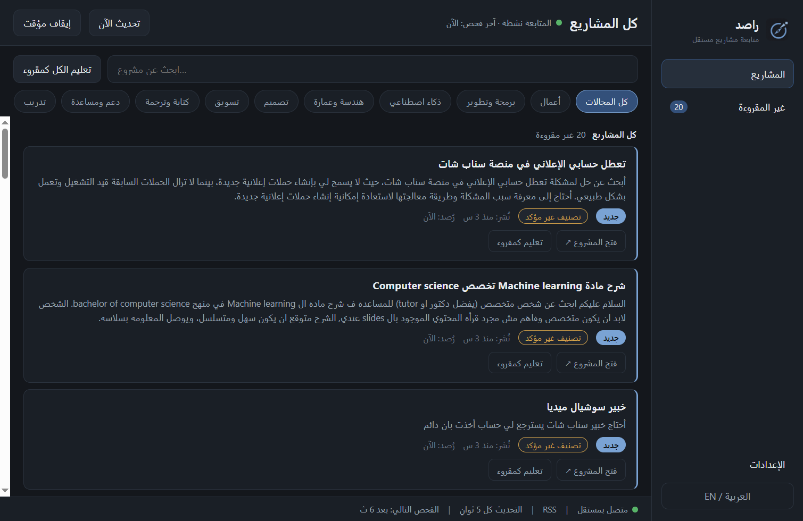

# RASED · راصد

تطبيق Windows محلي لمتابعة المشاريع الجديدة في [مستقل](https://mostaql.com/) من خلاصته العامة RSS. يعرض المشاريع وينبّهك بها؛ تقديم العروض يتم بنفسك على موقع مستقل. لا يحتاج سيرفر أو حساب داخل التطبيق.



## تحميل التطبيق لأصحابك

حمّل **`RASED Setup 0.1.1.exe`** من [صفحة الإصدارات](https://github.com/deved234/rased/releases/latest) وشغّله على Windows x64. لا يحتاج تثبيت Node.js أو SQLite. المثبّت غير موقّع رقميًا حاليًا، ولذلك قد يظهر تحذير من Windows؛ تأكد من مصدر التحميل. بصمة SHA-256 للإصدار 0.1.1:

```text
3848BD17D39842C7D6C88E943A1695014C55A1E3CA3C0F34907895D0DE9D48CD
```

أول فحص ناجح يحفظ المشاريع الموجودة كنقطة بداية دون تنبيهات قديمة. بعده تظهر المشاريع الجديدة في القائمة ويُرسل تنبيه Windows بحسب الفلاتر التي تختارها. يمكن إغلاق النافذة مع استمرار المتابعة من أيقونة النظام، أو إيقافها من التطبيق. البيانات والإعدادات تُحفظ محليًا في `%APPDATA%\RASED\rased.db`.

## تشغيل الكود وتطويره

المطلوب: Windows وNode.js 24 مع npm. لا تحتاج تثبيت Electron أو SQLite منفصلين؛ `npm ci` يثبت الاعتماديات وSQLite مدمجة مع Node.

```powershell
git clone https://github.com/deved234/rased.git
cd rased
npm ci
npm run dev
```

أوامر الفحص والبناء:

```powershell
npm run typecheck
npm run lint
npm test
npm run build
npm run dist
```

`npm run dist` يُخرج مثبّت Windows داخل `release/`. المجلدان `out/` و`release/` ناتجان عن البناء وغير محفوظين في Git؛ التحميل الجاهز يوجد في GitHub Releases.

## عن المشروع

- Electron 44 وReact 19 وTypeScript و`node:sqlite`.
- واجهة عربية RTL وإنجليزية LTR، مع تصميم داكن هادئ.
- فحص RSS افتراضيًا كل 5 ثوانٍ، وفلاتر للمجالات والكلمات، وتنبيهات Windows وصوت اختياري.
- احترام `Retry-After` وفترات التهدئة عند الأخطاء أو تقييد الطلبات. لا تسجيل دخول، ولا إرسال عروض آلي، ولا تجاوز لحماية الموقع.
- توقيت نشر المشروع في RSS واستجابة الشبكة خارج سيطرة التطبيق؛ لا يمكن ضمان وصول التنبيه لحظيًا أو قبل كل المنافسين.

الخطة والمراجعة التقنية في [PROJECT_HANDOFF.md](PROJECT_HANDOFF.md)، [IMPLEMENTATION_PLAN.md](IMPLEMENTATION_PLAN.md)، و[FIX_REPORT.md](FIX_REPORT.md). للمساهمة اقرأ [CONTRIBUTING.md](CONTRIBUTING.md). المشروع متاح برخصة [MIT](LICENSE).

---

## English

RASED is a local Windows app that watches the public [Mostaql](https://mostaql.com/) RSS feed for new projects. It shows projects and alerts you; you submit proposals yourself in your browser. No server or app account is required.

Download the Windows x64 installer from [Releases](https://github.com/deved234/rased/releases/latest). Node.js and SQLite are **not** required for end users. The installer is currently unsigned, so verify its source and the SHA-256 above. The first successful fetch establishes a silent baseline; later projects can trigger notifications.

To develop, install Node.js 24, clone this repository, run `npm ci`, then `npm run dev`. Run `npm run typecheck`, `npm run lint`, and `npm test` before contributing. `npm run dist` builds the installer locally. See [CONTRIBUTING.md](CONTRIBUTING.md) and the [MIT license](LICENSE).
