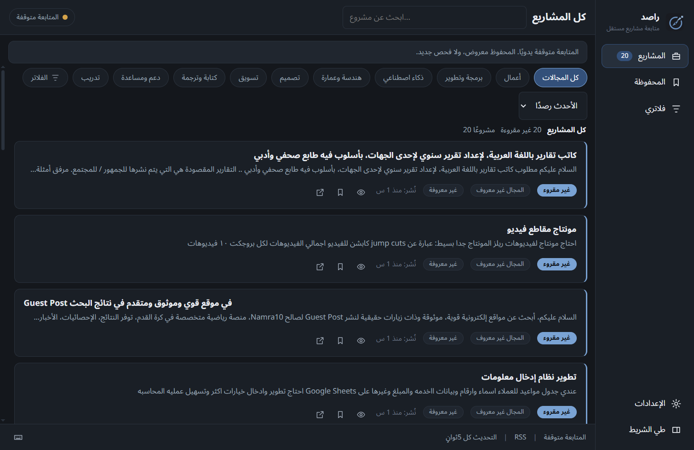
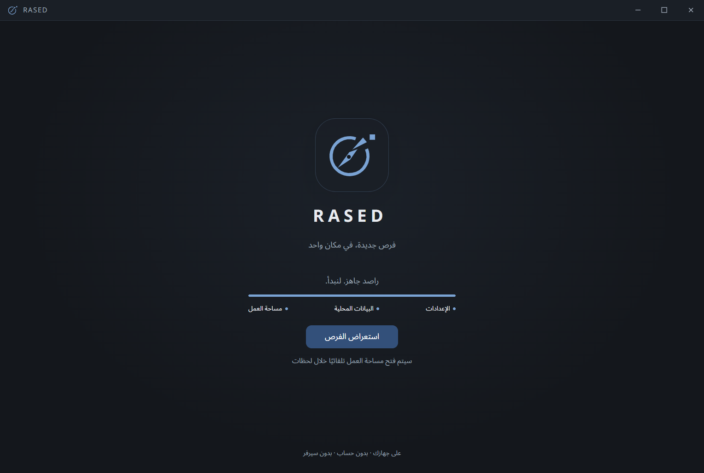

# RASED · راصد

تطبيق Windows محلي لمتابعة المشاريع الجديدة في [مستقل](https://mostaql.com/) من خلاصته العامة RSS. يعرض المشاريع وينبّهك بها؛ تقديم العروض يتم بنفسك على موقع مستقل. لا يحتاج سيرفر أو حساب داخل التطبيق.



## تحميل التطبيق لأصحابك

**الإصدار الحالي: [RASED 0.2.6](https://github.com/deved234/rased/releases/tag/v0.2.6)**. راجع [سجل التغييرات](CHANGELOG.md) و[ملاحظات الإصدار والتحقق](docs/RELEASE_0.2.6.md).

حمّل **`RASED-Setup-0.2.6.exe`** من [صفحة الإصدارات](https://github.com/deved234/rased/releases/latest) → **Assets** وشغّله على Windows x64. لا تختار Source code إن كنت تريد تشغيل التطبيق فقط. لا تحتاج تثبيت Node.js أو SQLite. المثبّت غير موقّع رقميًا حاليًا، ولذلك قد يظهر تحذير من Windows؛ تأكد من مصدر التحميل. بصمة SHA-256 متاحة في ملف `SHA256SUMS.txt` مع التحميل، ويمكن حسابها للمقارنة بالأمر:

```powershell
Get-FileHash -Algorithm SHA256 -LiteralPath '.\RASED-Setup-0.2.6.exe'
```

أول فحص ناجح يحفظ المشاريع الموجودة كنقطة بداية دون تنبيهات قديمة. بعده تظهر المشاريع الجديدة في القائمة ويُرسل تنبيه Windows بحسب الفلاتر التي تختارها. يمكن إغلاق النافذة مع استمرار المتابعة من أيقونة النظام، أو إيقافها من التطبيق. البيانات والإعدادات تُحفظ محليًا في `%APPDATA%\RASED\rased.db`.

للتحديث، اخرج من راصد بالكامل من قائمة أيقونة النظام، ثم شغّل المثبت الجديد. لا تحذف مجلد البيانات. شاشة البداية تُعرض عند تشغيل العملية، وليس كل مرة تستعيد النافذة من أيقونة النظام. من 0.2.6، الإشعارات الجديدة تحمل رابط HTTPS يفتحه Windows مباشرة في المتصفح الافتراضي، حتى من مركز الإشعارات بعد خروج راصد. الإشعارات القديمة لا تتغير؛ اضغط بطاقة المشروع داخل راصد لعرض تفاصيله داخل التطبيق.

**التحديث من داخل البرنامج:** 0.2.5 أول نسخة تدعم الميزة. أصحاب 0.2.4 أو أقدم يحتاجون تثبيتها يدويًا مرة واحدة. بعدها راصد يفحص GitHub عند التشغيل وكل 6 ساعات، ويمكنك من **الإعدادات → تحديثات راصد** تحميل التحديث ومتابعة تقدّمه ثم إعادة التشغيل والتثبيت. لا تحميل أو تثبيت إجباري، ولا تثبيت بمجرد إغلاق البرنامج، مع حماية الملاحظات غير المحفوظة. [تفاصيل التحديث والنشر](docs/UPDATES.md).



## تشغيل الكود وتطويره

المطلوب: Windows وNode.js 24 مع npm. لا تحتاج تثبيت Electron أو SQLite منفصلين؛ `npm ci` يثبت الاعتماديات وSQLite مدمجة مع Node.

```powershell
git clone https://github.com/deved234/rased.git
cd rased
npm ci
npm run dev
```

`npm run dev` يفتح نافذة Electron مستقلة (مش تبويب في المتصفح). لو ملف Electron التنفيذي ناقص بعد تثبيت المكتبات، الأمر يحمّله تلقائيًا قبل فتح النافذة؛ أول تشغيل قد يأخذ وقتًا أطول. الرابط `localhost:5173` الذي يظهر في الـTerminal هو خادم واجهة React الداخلي.

أوامر الفحص والبناء:

```powershell
npm run typecheck
npm run lint
npm test
npm run build
npm run test:e2e
npm run dist
```

`npm run test:e2e` يختبر Electron الحقيقي بقاعدة مؤقتة جديدة وبيانات ثابتة؛ يستبدل الشبكة وإرسال OS فقط، ولا يستخدم بياناتك. للاختبار على النسخة المجمعة: `node scripts/e2e-cdp.mjs --exe="release/win-unpacked/RASED.exe" --app=""`. لا تستخدم profile موجودًا؛ السكربت يرفضه ولا يحذفه.

`npm run dist` يُخرج مثبّت Windows داخل `release/`. المجلدان `out/` و`release/` ناتجان عن البناء وغير محفوظين في Git؛ التحميل الجاهز يوجد في GitHub Releases.

## عن المشروع

- Electron 44 وReact 19 وTypeScript و`node:sqlite`.
- واجهة عربية RTL وإنجليزية LTR، مع تصميم داكن هادئ **ووضع فاتح** (0.2.1).
- فحص RSS افتراضيًا كل 5 ثوانٍ، وفلاتر للمجالات والكلمات والميزانية (بعضها محفوظ بأسماء)، وتنبيهات Windows وصوت اختياري ووضع عدم إزعاج.
- صفحة تفاصيل داخل التطبيق لكل مشروع (نص كامل عند توفره)، محفوظات وحالات شخصية وملاحظات محلية، ونافذة متابعة صغيرة اختيارية.
- احترام `Retry-After` وفترات التهدئة عند الأخطاء أو تقييد الطلبات. لا تسجيل دخول، ولا إرسال عروض آلي، ولا تجاوز لحماية الموقع.
- توقيت نشر المشروع في RSS واستجابة الشبكة خارج سيطرة التطبيق؛ لا يمكن ضمان وصول التنبيه لحظيًا أو قبل كل المنافسين.

مؤسس ومطوّر راصد: **david atef** — [GitHub](https://github.com/deved234) · [LinkedIn](https://www.linkedin.com/in/david-atef/).

الخطة والمراجعة التقنية في [PROJECT_HANDOFF.md](PROJECT_HANDOFF.md)، [IMPLEMENTATION_PLAN.md](IMPLEMENTATION_PLAN.md)، و[FIX_REPORT.md](FIX_REPORT.md)، و[إصلاحات الواجهة 0.2.1](docs/UI_UX_FIX_REPORT.md). للمساهمة اقرأ [CONTRIBUTING.md](CONTRIBUTING.md). للإبلاغ عن مشكلة استخدم [Issues](https://github.com/deved234/rased/issues). المشروع متاح برخصة [MIT](LICENSE).

---

## English

RASED is a local Windows app that watches the public [Mostaql](https://mostaql.com/) RSS feed for new projects. It shows projects and alerts you; you submit proposals yourself in your browser. No server or app account is required.

Download **RASED-Setup-0.2.6.exe** under **Assets** in [Releases](https://github.com/deved234/rased/releases/latest), rather than the Source code archives. Node.js and SQLite are **not** required for end users. The installer is currently unsigned; verify its source and the downloadable SHA256SUMS.txt. Quit RASED fully from the tray before this initial upgrade. The first successful fetch establishes a silent baseline; later projects can trigger notifications. Clicking a project notification opens your default browser.

0.2.5 adds in-app updates: Settings → RASED updates, then Download update and Restart and update. Checks run at startup and every 6 hours; download/install are explicit, with unsaved-note protection. Users coming from 0.2.4 or older need one manual install of this first updater-capable version. See the [update/release guide](docs/UPDATES.md).

To develop, install Node.js 24, clone this repository, run `npm ci`, then `npm run dev`. Run `npm run typecheck`, `npm run lint`, and `npm test` before contributing. `npm run dist` builds the installer locally. See [CONTRIBUTING.md](CONTRIBUTING.md) and the [MIT license](LICENSE).

`npm run dev` opens an Electron desktop window. If the Electron executable is missing, the dev command downloads it before launching. The printed `localhost:5173` URL is the internal React development server.


## الشروط والخصوصية والحقوق

اقرأ [شروط راصد](TERMS.md) و[الخصوصية](PRIVACY.md)، المتاحتين أيضًا داخل الإعدادات. ترخيص MIT يخص الكود ولا يمنح حقوقًا في محتوى مستقل أو إذنًا بالجلب الآلي. راصد مستقل عن حسوب/مستقل، ولم نتلق هنا موافقة مكتوبة منهما. [مراجعة المصادر والمخاطر](docs/legal/LEGAL_REVIEW.md) و[مسودة طلب الإذن](docs/legal/PERMISSION_REQUEST.md) موثقتان؛ لم تُرسل المسودة.

[رخص المكونات والخطوط](resources/legal/THIRD_PARTY_NOTICES.txt) مرفقة مع التطبيق، مع رخص Electron وChromium في التوزيع. لا توجد تحليلات أو رفع آلي للمطور؛ الجهاز يتصل بمستقل مباشرة وقد يرى المصدر IP ومعلومات الطلب. البيانات المحلية والنسخ الاحتياطية غير مشفرة بواسطة التطبيق.

في 0.2.3 أُضيف شريط نافذة مخصص وأيقونة بوصلة متجهية مضبوطة المركز. `npm run icons` يولّد PNG/ICO/Tray منها، و`prebuild` يجمع المستندات القانونية والرخص تلقائيًا.
