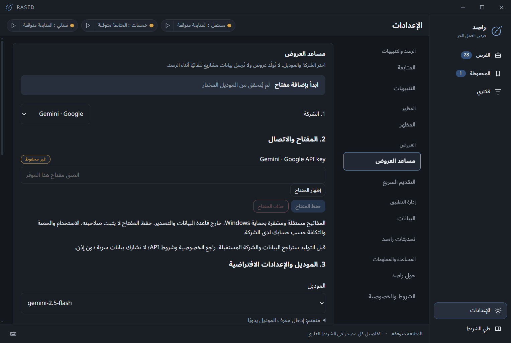

# Proposal Assistant

The assistant creates editable proposals for **Mostaql projects only**. Gemini, OpenAI and Anthropic Claude are supported directly. API access and consumer chat subscriptions are separate; quotas and billing belong to your provider account.

## Configure and generate

1. Open Settings → Proposal Assistant. Choose a provider and save its API key. Saved means stored, not validated against the provider.
2. Request a model-list refresh, then select a model. Advanced settings accept a manual model ID with compatibility warnings; catalog visibility does not prove generation access.
3. Enter your real specialization, experience, relevant work and preferred proposal style. Save the default settings. Do not invent credentials or promise unavailable services.
4. Optionally use Test generation. It sends synthetic data, requires confirmation, may consume quota and saves no draft.
5. From a Mostaql project, open the assistant. You can temporarily choose another provider/model for this draft without changing the default.
6. Review the outgoing project text, freelancer profile and instructions, then explicitly generate. Edit/copy the draft and submit it yourself on the platform.

## Data and behavior

Each provider has a separate Windows-encrypted key under the local app-data directory. Keys are not included in settings exports. Existing Gemini keys migrate only after a verified replacement. Older drafts and profiles remain available; new drafts record provider/model provenance.

Network hosts are fixed HTTPS endpoints. One generation request runs at a time; generation times out after 45 seconds and catalog loading after 15 seconds. Cancellation, changing the key or leaving the generation view prevents a late response from becoming a saved draft. There is no automatic paid retry or fallback to another company.

The app uses Gemini generateContent, OpenAI Responses (`store:false`) and Claude Messages. Provider retention policies still apply; `store:false` does not promise zero retention. Read [Privacy](../PRIVACY.md).

## Verification and limitations

Provider request/response contracts, errors, cancellation, encrypted storage, migration and real Electron/React/SQLite wiring are tested with synthetic API responses. **Live API calls for this multi-provider release have not been verified with real keys.** Use the in-app test with your own account; do not send keys to the maintainer.

Unknown/new models may reject parameters or produce invalid/truncated output. The app reports the error rather than saving an incomplete draft or making another paid request. Model availability, cost and Arabic proposal quality depend on the provider and account.

On a brand-new Windows profile, forcibly killing the app before its first normal exit can prevent Chromium from persisting encryption state. Keys may then require re-entry. A normal first exit and restart preserve keys; crash-proof storage is not guaranteed.

## Editing safely

Provider selection, key storage, model defaults and your freelancer profile are separate steps. Keys are masked, with an optional Show/Hide control. “Key saved” is different from a successfully tested model; requesting a generation test asks for confirmation because it can consume provider credits or quota.

Explicitly save each group. Navigation protects an edited profile, unsaved key, changed defaults and edited proposal text. Failed saves retain edits; saving and continuing proceeds only after success. Project previews show readable profile fields, and copying a proposal excludes separate assumptions/questions. Changing request input or model requires a new preview and consent.
