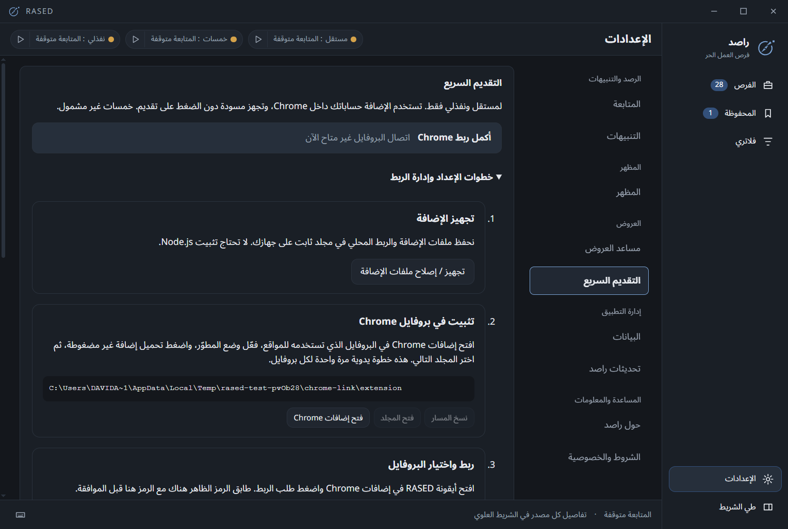

# Chrome Quick Apply

Quick Apply fills a saved proposal on **Mostaql and Nafezly** using your normal Chrome session. Khamsat is not supported. The extension is free and loaded manually; RASED cannot silently install it or enable Chrome developer mode for you.

## Install and pair once per Chrome profile

1. Open RASED Settings → Quick Apply → Prepare extension files.
2. Open Chrome's extensions page from RASED, enable **Developer mode**, then choose **Load unpacked**. Select the folder displayed by RASED; use Copy path if needed.
3. Open the RASED extension from Chrome's toolbar and request pairing.
4. Match the six-digit code shown in Chrome with the code in RASED. Approve and name the profile, then select it as the destination.
5. Save your proposal template, budget position (0–100%) and extra days. Enable Quick Apply. Sign in to the platforms in this same Chrome profile, including Google sign-in if desired.

## Use

Click **Prepare draft** on a supported project card/details or its individual Windows notification when available. RASED sends the saved template to the selected paired profile, opens the project and fills the form where supported. **Review all fields and press the platform's submit button yourself. RASED never submits the offer.** The notification body and View project action open the ordinary project URL in your default browser.

Price = minimum + (maximum − minimum) × percentage / 100, adjusted to the form's accepted step/range. For $25–50, 0% selects $25 and 100% selects $50. Duration = the client's available duration + your extra days. Missing/invalid data is left for manual review, not fabricated.

An existing draft is preserved. Clear/edit it yourself before starting another fill. Repeated clicks focus a known open project tab rather than refill it. Disabling the feature or revoking/changing the destination cancels pending work.

## Troubleshooting and updates

- Keep RASED running and use the selected paired Chrome profile. If Chrome opens another profile, switch to the paired one and retry explicitly. Automatic selection of a closed profile is not guaranteed.
- If the login page appears, sign in normally, return to the project and retry. No passwords/cookies are transferred into RASED.
- After updating RASED, use Prepare/repair files if needed, then **Reload** the unpacked extension in Chrome. Chrome does not update an unpacked extension from the store.
- Site changes, protection challenges, missing fields or expired jobs may require manual completion. No claim of faster submission than every competitor is made.
- To remove it, revoke pairing in RASED and remove the extension from Chrome. Uninstalling RASED does not automatically remove browser extensions or retained local user data.

The packaged native-messaging helper includes its runtime; end users do not need Node.js. Communication is local and authenticated. Pairing tokens protect transport; this does not defend against malware running as the same Windows user or administrator.

Automated verification uses real Chromium, the native executable and broker with intercepted fixture pages. It is not a live account/form test or proof of physical Windows notification activation. See [Privacy](../PRIVACY.md) and [Terms](../TERMS.md).

## Status and saving

Settings distinguish a paired profile from a currently connected profile. Setup steps collapse after pairing and remain available under pairing management. Save the template, budget position and extra days explicitly; navigating away offers Save and continue, Discard edits, or Stay here. A failed save keeps your edits.

An unpaired project action opens setup; a deliberately disabled feature opens its settings. Preparation status appears beside the matching project and in settings: waiting, opening, reading, ready, login needed, manual input, preserved draft, failure or timeout. Cancel is available only while a job is active. A ready draft still needs your review and manual submission in Chrome.
