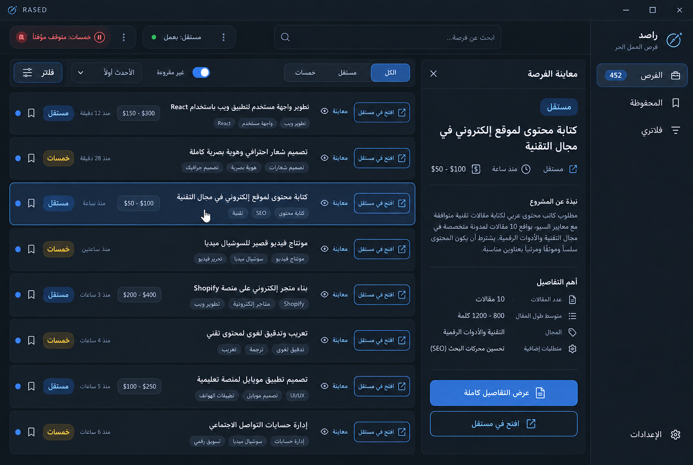

# تصور واجهة راصد وتحديث المعاينة

الصورة أعلاه **تصور بصري** مُعدل بعد توضيح سلوك المعاينة، وليست لقطة من التطبيق. أُنتجت بأداة imagegen انطلاقًا من [التصور الأول](screenshots/identity/ui-concept-v2.png). نصوص الفرص والأسعار والأوقات فيها أمثلة توضيحية، وليست بيانات حية أو وعودًا بتوفر هذه الحقول في خمسات.

التصميم الآن يوضح ثلاث حركات مختلفة: الضغط على الصف/العنوان أو «معاينة» يفتح اللوحة الجانبية، و«عرض التفاصيل كاملة» داخل اللوحة يفتح الصفحة الفردية داخل راصد، و«افتح في مستقل/خمسات» يفتح المتصفح. ويعرض شريط فلترة واحدًا وقائمة فرص أقصر وحالتي رصد مستقلتين. تحتفظ الصورة بهوية راصد وألوانه الداكنة الهادئة.

نُفذ هذا السلوك وتخطيط القائمة في الشيفرة بعد مراجعة التصور، ويمكن مقارنة [لقطة التطبيق الفعلية مع المعاينة مفتوحة](screenshots/identity/ar-preview.png) بالصورة المقترحة. قد تختلف تفاصيل التوزيع والنصوص بحسب حجم النافذة والبيانات الفعلية.

**موجز توليد الصورة:** تعديل لقطة واجهة راصد العربية الحالية إلى نموذج Windows عالي الدقة بنسبة سطح المكتب نفسها؛ الحفاظ على الشعار والشريط الجانبي RTL والألوان الداكنة؛ عرض فلتر مصدر ثلاثي «الكل/مستقل/خمسات» وبحث وفلتر وترتيب في شريط واحد؛ ثماني فرص مختصرة مع عنوان ومقتطف ومصدر وعمر وسعر حيث يتوفر وزر «افتح في مستقل/خمسات»؛ إظهار «مستقل: يعمل» و«خمسات: متوقف مؤقتًا» كحالتين مستقلتين؛ تجنب الألوان الصارخة والنص الوهمي قدر الإمكان.

**البرومبت المستخدم (imagegen، تحرير لقطة مرجعية):**

> Use case: ui-mockup. Edit the provided RASED Windows desktop screenshot as a visual concept for the NEXT interface, not a production screenshot. Preserve the existing identity: dark navy and charcoal palette, restrained muted blue accents, compass logo, right-side RTL sidebar, custom window title bar, Noto-like Arabic typography, desktop aspect ratio about 1528x1028. Make a high-fidelity clean professional Arabic UI mockup for a freelance opportunities monitor supporting Mostaql and Khamsat. Redesign the crowded area: a single compact filter toolbar near top with three-source segmented control «الكل | مستقل | خمسات», search, «غير مقروءة», sort dropdown, and «فلاتر»; no wrapping jungle of category chips. Show a compact, legible feed with 7-8 opportunity rows visible, each row 85-100px: clear opportunity title (Arabic realistic examples), one-line excerpt, platform badge, discovered-relative time, optional Mostaql budget, unread marker, bookmark, and a clearly labeled blue-outline browser action button «افتح في مستقل» or «افتح في خمسات». Keep comfortable spacing and accessible contrast, no garish gradients or glowing neon. Top left show TWO independent slim source status pills «مستقل: يعمل» and «خمسات: متوقف مؤقتًا», each with its own three-dot/pause control. In right sidebar: RASED/راصد, subtitle «فرص العمل الحر», nav «الفرص», «المحفوظة», «فلاتري», bottom «الإعدادات». Show exactly one source paused while the other still active. Avoid gibberish; prioritize legible Arabic labels, plausible desktop controls, precise alignment and polish. Do not render a phone mockup or marketing poster.

**برومبت التعديل الثاني (imagegen، الصورة السابقة مرجع):** تحرير تصور راصد السابق مع الحفاظ على الهوية الداكنة والشريط الجانبي RTL والصفوف المختصرة. إضافة زر نصي «معاينة» لكل صف، تحديد صف واحد وفتح معاينته الجانبية في نحو 38% من المساحة، وداخل المعاينة زري «عرض التفاصيل كاملة» و«افتح في مستقل» بوظيفتين مختلفتين. إبقاء حالتي مستقل وخمسات المنفصلتين، وتجنب النصوص العشوائية والألوان الصارخة.

## الإيقاف المنفصل المنفّذ الآن

أصبح الإيقاف المؤقت لكل مصدر مستقلًا في حلقة الفحص وفي نافذة الحالة والإعدادات وقائمة Tray. إيقاف مستقل لا يمنع خمسات من الفحص، وإيقاف خمسات لا يمنع مستقل. الإيقاف مؤقت للجلسة ويعود المصدر عند إعادة تشغيل راصد؛ أما «تفعيل المصدر» لخمسات فهو إعداد محفوظ. لا يغير هذا العمل تخطيط قائمة الفرص المقترح أعلاه.
